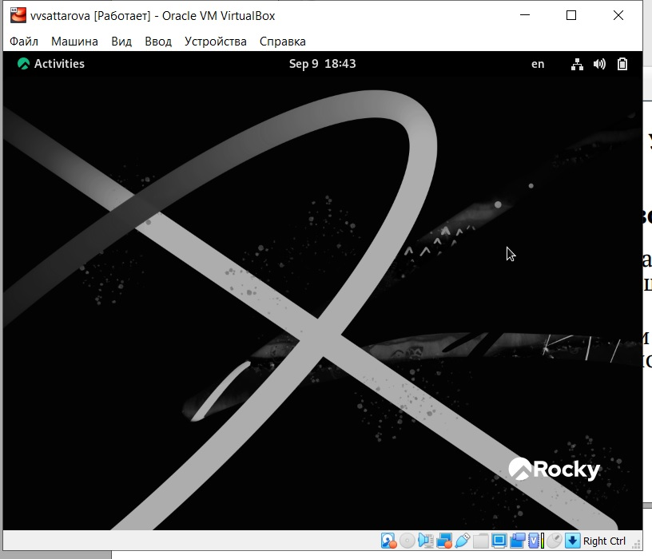
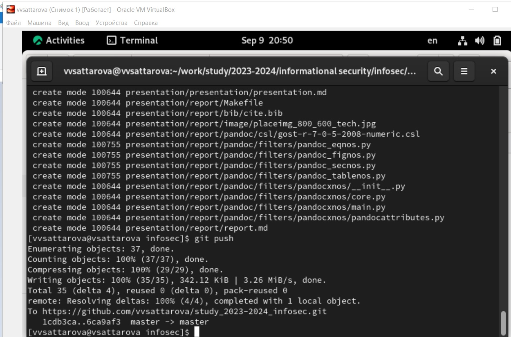
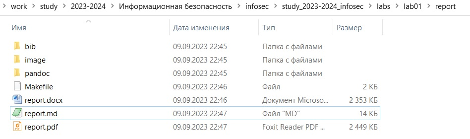

---
## Front matter
lang: ru-RU
title: Презентация к лабораторной работе 1
subtitle: Установка и конфигурация операционной системы на виртуальную машину, подготовка рабочего пространства, создание отчёта в markdown
author:
  - Саттарова В.В.
institute:
  - Российский университет дружбы народов, Москва, Россия
date: 9 сентября 2023

## i18n babel
babel-lang: russian
babel-otherlangs: english

## Formatting pdf
toc: false
toc-title: Содержание
slide_level: 2
aspectratio: 169
section-titles: true
theme: metropolis
mainfont: PT Serif
romanfont: PT Serif
sansfont: PT Sans
monofont: PT Mono
header-includes:
 - \metroset{progressbar=frametitle,sectionpage=progressbar,numbering=fraction}
 - '\makeatletter'
 - '\beamer@ignorenonframefalse'
 - '\makeatother'
---

# Информация

## Докладчик

:::::::::::::: {.columns align=center}
::: {.column width="70%"}

  * Саттарова Вита Викторовна
  * студент
  * Российский университет дружбы народов

:::
::::::::::::::

# Вводная часть

## Актуальность и прагматика

- Подготовленная виртуальная машина с установленной ОС будет использоваться для дальнейшей работы по курсу
- Рабочее пространство и github будут использоваться для дальнейшей работы по курсу
- Отчёты по курсу делаются с использованием markdown

## Цели 

- Подготовить операционную систему для работы.
- Создать репозиторий для загрузки работ.
- Написать отчёт.

## Задачи

- Вспомнить особенности установки операционной системы на виртуальную машину.
- Вспомнить особенности настройки минимально необходимых для дальнейшей работы сервисов.
- Подготовить рабочее пространство для выполнения задач курса "Информационная безопасность". 
- Вспомнить основные этапы работы с github. 
- Вспомнить правила работы markdown.
- Вспомнить особенности написания файлов (отчётов) в markdown.

## Новая виртуальная машина с готовой к работе ОС Rocky Linux

## Обновление структуры репозитория на Github

## Пример готовой папки с отчётами в разных фомратах

# Результаты

- Полученная машина будет использоваться для выполнения дальнейших работ курса
- Полученный репозиторий будет использоваться для дальнейшей работы
- Полученные навыки написания отчёта пригодятся в дальнейшем для написания таких же отчётов
