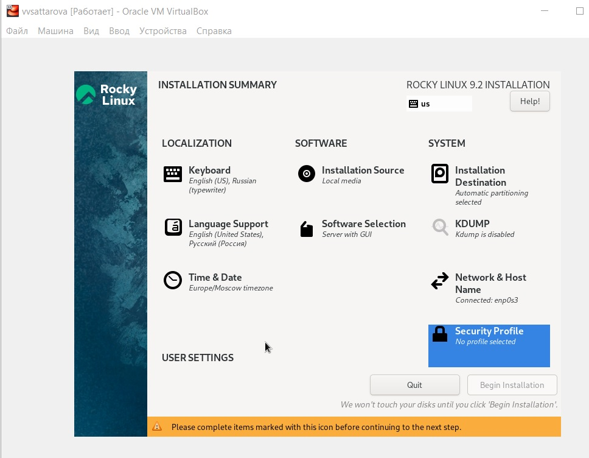

---
## Front matter
title: "Отчёт по лабораторной работе №1 по предмету Информационная безопасность"
subtitle: "Установка и конфигурация операционной системы на виртуальную машину, подготовка рабочего пространства, создание отчёта в markdown"
author: "Саттарова Вита Викторовна"
teacher: "Кулябов Дмитрий Сергеевич"

## Generic otions
lang: ru-RU
toc-title: "Содержание"

## Bibliography
bibliography: bib/cite.bib
csl: pandoc/csl/gost-r-7-0-5-2008-numeric.csl

## Pdf output format
toc: true # Table of contents
toc-depth: 2
lof: true # List of figures
lot: true # List of tables
fontsize: 12pt
linestretch: 1.5
papersize: a4
documentclass: scrreprt
## I18n polyglossia
polyglossia-lang:
  name: russian
  options:
	- spelling=modern
	- babelshorthands=true
polyglossia-otherlangs:
  name: english
## I18n babel
babel-lang: russian
babel-otherlangs: english
## Fonts
mainfont: PT Serif
romanfont: PT Serif
sansfont: PT Sans
monofont: PT Mono
mainfontoptions: Ligatures=TeX
romanfontoptions: Ligatures=TeX
sansfontoptions: Ligatures=TeX,Scale=MatchLowercase
monofontoptions: Scale=MatchLowercase,Scale=0.9
## Biblatex
biblatex: true
biblio-style: "gost-numeric"
biblatexoptions:
  - parentracker=true
  - backend=biber
  - hyperref=auto
  - language=auto
  - autolang=other*
  - citestyle=gost-numeric
## Pandoc-crossref LaTeX customization
figureTitle: "Рис."
tableTitle: "Таблица"
listingTitle: "Листинг"
lofTitle: "Список иллюстраций"
lotTitle: "Список таблиц"
lolTitle: "Листинги"
## Misc options
indent: true
header-includes:
  - \usepackage{indentfirst}
  - \usepackage{float} # keep figures where there are in the text
  - \floatplacement{figure}{H} # keep figures where there are in the text
---

# Цели и задачи работы

**Цели:**

- Подготовить операционную систему для работы.
- Создать репозиторий для загрузки работ.
- Написать отчёт.

**Задачи:**

- Вспомнить особенности установки операционной системы на виртуальную машину.
- Вспомнить особенности настройки минимально необходимых для дальнейшей работы сервисов.
- Подготовить рабочее пространство для выполнения задач курса "Информационная безопасность". 
- Вспомнить основные этапы работы с github. 
- Вспомнить правила работы markdown.
- Вспомнить особенности написания файлов (отчётов) в markdown.

# Объект и предмет исследования

**Объект исследования:** подготовка системы к работе

**Предмет исследования:** работа с VirtualBox, установка Linux, настройка Github, работа с Markdown

# Условные обозначения и термины

**Условные обозначения**

- ОС - операционная система

**Термины**

- Виртуальная машина
- Рабочее пространство
- Легковесный язык разметки 

# Задание

- Установить на виртуальную машину VirtualBox (https://www.virtualbox.org/) операционной системы Linux (дистрибутив Rocky (https://rockylinux.org/).
- Создать каталоги для работы на основе документа "Рабочее пространство для лабораторной работы".
- Сделать отчёт по лабораторной работе в формате Markdown.

# Теоретическое введение

## Установка операционной системы на виртуальную машину

1. Создайте новую виртуальную машину. Для этого в VirtualBox выберите: "Машина" -> "Создать".

1. Укажите имя виртуальной машины, тип операционной системы.

1. Укажите размер основной памяти виртуальной машины.

1. Задайте конфигурацию жёсткого диска и размер.

1. Выберите в VirtualBox для Вашей виртуальной машины "Настройки" -> "Носители". Добавьте новый привод оптических дисков и выберите образ
операционной системы.

1. Запустите виртуальную машину, выберите язык интерфейса и перейдите к настройкам установки операционной
системы.

1. При необходимости скорректируйте часовой пояс, раскладку клавиатуры.

1. В разделе выбора программ укажите базовое окружение и дополнение.

1. Отключите KDUMP. Место установки ОС оставьте без изменения.

1. Включите сетевое соединение и измените имя узла.

1. Установите пароль для root и пользователя с правами администратора.

1. После завершения установки операционной системы корректно перезапустите виртуальную машину. В VirtualBox оптический диск должен отключиться автоматически, но если
это не произошло, то необходимо отключить носитель информации с образом, выбрав "Свойства" -> "Носители" -> "<название_диска>" -> "Удалить устройство".

1. Войдите в ОС под заданной вами при установке учётной записью. В меню "Устройства виртуальной машины" подключите образ диска дополнений гостевой ОС, при необходимости введите пароль пользователя root вашей виртуальной ОС.

1. После загрузки дополнений нажмите Return или Enter и корректно перезагрузите виртуальную машину.

## Подготовка рабочего пространства 

Рабочее пространство по предмету располагается в следующей иерархии:

```
~/work/study/
└── <учебный год>/
    └── <название предмета>/
        └── <код предмета>/
```

Например, для 2023-2024 учебного года и предмета «Информационная безопасность» (код предмета infosec) структура каталогов примет следующий вид:

```
~/work/study/
└── 2023-2024/
    └── "Информационная безопасность"/
        └── infosec/
```

Название проекта на хостинге git имеет вид: *study_<учебный год>_<код предмета>*

Например, для 2023–2024 учебного года и предмета «Информационная безопасность» (код предмета infosec) название проекта примет следующий вид: *study_2023-2024_infosec*.

Каталог для лабораторных работ имеет вид labs.

Каталоги для лабораторных работ имеют вид lab<номер>, например: lab01, lab02 и т.д.

**Шаблон для рабочего пространства**

Репозиторий: https://github.com/yamadharma/course-directory-student-template.

*Создание репозитория курса на основе шаблона*

Репозиторий на основе шаблона можно создать либо вручную, через web-интерфейс, либо с помощью утилит gh.

**Настройка каталога курса**

1. Перейдите в каталог курса:

```
cd ~/work/study/2023-2024/"Информационная безопасность"/infosec
```

1. Удалите лишние файлы: package.json

1. Создайте необходимые каталоги:

echo infosec > COURSE, labs/lab01, ..., lab08

1. Отправьте файлы на сервер:

- git add .
- git commit -am 'feat(main): make course structure'
- git push

## Markdown

1. Чтобы создать заголовок, используйте знак (#), например:

- (# This is heading 1)
- (## This is heading 2)
- (### This is heading 3)
- (#### This is heading 4) (Без скобочек () при использовании)

1. Чтобы задать для текста полужирное начертание, заключите его в двойные звездочки:

This text is ** bold **. (Без пробелов при использовании)

1. Чтобы задать для текста курсивное начертание, заключите его в одинарные звездочки:

This text is * italic *. (Без пробелов при использовании)

1. Чтобы задать для текста полужирное и курсивное начертание, заключите его в тройные звездочки:

This is text is both * * * bold and italic * * *. (Без пробелов при использовании)

1. Блоки цитирования создаются с помощью символа >:

(>) The drought had lasted now for ten million years. (Без скобочек () при использовании)

1. Неупорядоченный (маркированный) список можно отформатировать с помощью звездочек или тире:

(- List item 1 - List item 2 - List item 3) (Каждый элемент на своей строке и без скобочек ())

1. Чтобы вложить один список в другой, добавьте отступ для элементов дочернего списка.

1. Упорядоченный список можно отформатировать с помощью цифр:

(1. First instruction 1. Second instruction 1. Third instruction) (Каждый элемент на своей строке и без скобочек ())

1. Синтаксис Markdown для встроенной ссылки состоит из части [link text], представляющей текст гиперссылки, и части(file-name.md) – URL-адреса или имени файла, на который дается ссылка.

1. Markdown поддерживает как встраивание фрагментов кода в предложение, так и их размещение между предложениями в виде отдельных огражденных блоков. Огражденные блоки кода — это простой способ выделить синтаксис для фрагментов кода. Общий формат огражденных блоков кода: ``` в строке над первой строчкой кода и в строке после кода.

**Обработка файлов в формате Markdown**

Для обработки файлов в формате Markdown будем использовать Pandoc https://pandoc.org/. Конкретно, нам понадобится программа pandoc, pandoc-citeproc https://github.com/jgm/pandoc/releases, pandoccrossref https://github.com/lierdakil/pandoc-crossref/releases.

Преобразовать файл README.md можно следующим образом:

```
pandoc README.md -o README.pdf
```

или так

```
pandoc README.md -o README.docx
```

Можно использовать следующий *Makefile*

```
FILES = $(patsubst %.md, %.docx, $(wildcard *.md))
FILES += $(patsubst %.md, %.pdf, $(wildcard *.md))
LATEX_FORMAT =
FILTER = --filter pandoc-crossref
%.docx: %.md
-pandoc "$<" $(FILTER) -o "$@"
%.pdf: %.md
-pandoc "$<" $(LATEX_FORMAT) $(FILTER) -o "$@"
all: $(FILES)
@echo $(FILES)
clean:
-rm $(FILES) *~
```

Более подробно о работе см. в [@course:infosec_lab1].

# Техническое оснащение и выбранные методы проведения работы

**Техническое оснащение**

- Ноутбук
- VirtualBox
- Rocky Linux
- Gitflow
- gh
- Markdown
- pandoc
- Интернет

**Методы проведения работы**

- Изучение методической информации
- Выполнение заданий в соответствии с указаниями
- Сравнение и анализ результатов с образцами
- Обобщение проведённой деятельности

# Выполнение лабораторной работы и полученные результаты

1. Зашла на ТУИС на страницу курса и посмотрела материалы к лабораторной работе (рис. @fig:001)

{ #fig:001 width=100% }

1. Скачав предварительно образ ОС, перед установкой проверила папку для установки машин. (рис. @fig:002)

{ #fig:002 width=100% }

1. Начала создание новой виртуальной машины, указав название, тип и версию ОС. (рис. @fig:003)

{ #fig:003 width=100% }

1. Указала объём оперативной памяти новой машины. (рис. @fig:004)

{ #fig:004 width=100% }

1. Указала создание нового жёсткого диска. (рис. @fig:005)

{ #fig:005 width=100% }

1. Указала тип виртуального жёсткого диска. (рис. @fig:006)

{ #fig:006 width=100% }

1. Указала формат хранения информации на новом жёстком диске. (рис. @fig:007)

{ #fig:007 width=100% }

1. Указала имя и размер файла с виртуальным жёстким диском. (рис. @fig:008)

{ #fig:008 width=100% }

1. Подключила образ необходимой ОС. (рис. @fig:009)

{ #fig:009 width=100% }

1. Запустила машину и начала установку ОС. (рис. @fig:010)

{ #fig:010 width=100% }

1. Поставила в качестве основного языка для установки и работы английский язык. (рис. @fig:011)

{ #fig:011 width=100% }

1. Добавила русскую раскладку. (рис. @fig:012)

{ #fig:012 width=100% }

1. Установила базовое окружение и выбрала категорию дополнительных программ для установки. (рис. @fig:013)

{ #fig:013 width=100% }

1. Убрала KDUMP. (рис. @fig:014)

{ #fig:014 width=100% }

1. Установила подключение к интернету и добавила имя хоста. (рис. @fig:015)

{ #fig:015 width=100% }

1. Итог настроек для установки новой ОС. (рис. @fig:016)

{ #fig:016 width=100% }

1. Установила пароль для корневого пользователя. (рис. @fig:017)

{ #fig:017 width=100% }

1. Начала установку новой операционной системы. (рис. @fig:018)

{ #fig:018 width=100% }

1. Дождалась завершения установки. (рис. @fig:019)

{ #fig:019 width=100% }

1. Запустила машину с новой установленной операционной системой. (рис. @fig:020)

{ #fig:020 width=100% }

1. Установила имя пользователя новой ОС. (рис. @fig:021)

{ #fig:021 width=100% }

1. Закончила первичную установку и получила доступ к рабочему столу. (рис. @fig:022)

{ #fig:022 width=100% }

1. Подключала образ дополнений гостевой ОС. (рис. @fig:023)

{ #fig:023 width=100% }

1. Создала все папки для пути к рабочему каталогу. (рис. @fig:024)

{ #fig:024 width=100% }

1. Добавила нового пользователя через командную строку. (рис. @fig:025)

{ #fig:025 width=100% }

1. Начала выполнять дополнительное задание, посмотрела версию ядра ОС, частоту процессора, модель процессора, объём доступной оперативной памяти. (рис. @fig:026)

{ #fig:026 width=100% }

1. Продолжила выполнять дополнительное задание, посмотрела тип гипервизора, тип файловой системы и последовательность монтирования файловых систем первым способом. (рис. @fig:027)

{ #fig:027 width=100% }

1. Закончила выполнять дополнительное задание, посмотрела последовательность монтирования файловых систем вторым способом. (рис. @fig:028)

{ #fig:028 width=100% }

1. Начала работу с github, установила gitflow. (рис. @fig:029)

{ #fig:029 width=100% }

1. Установила утилиту gh для работы через командную строку. (рис. @fig:030)

{ #fig:030 width=100% }

1. Выполнила настройку загрузки на github, начала генерацию ssh ключей. (рис. @fig:031)

{ #fig:031 width=100% }

1. Сгенерировала по другому алгоритму ssh ключ, начала генерацию ключа gpg. (рис. @fig:032)

{ #fig:032 width=100% }

1. Сгенерировала ключ gpg и вывела его на экран для копирования. (рис. @fig:033)

{ #fig:033 width=100% }

1. Добавила ключи в github. (рис. @fig:034)

{ #fig:034 width=100% }

1. Авторизавалась в github в командной строке и перешла в нужную папку на устройстве. (рис. @fig:035)

{ #fig:035 width=100% }

1. Клонировала репозиторий в конечную папку рабочего пространства (рис. @fig:036)

{ #fig:036 width=100% }

1. Настроила каталог курса: удалила ненужные файлы, создала каталоги для добавления и наполнила их шаблонами для дальнейшей работы (рис. @fig:037)

{ #fig:037 width=100% }

1. Отправила файлы на сервер в свой репозиторий github (рис. @fig:038)

{ #fig:038 width=100% }

1. Открыла отчёт с предмета с прошлого курса для лабораторной работы и изменяла его в соответствии с лабораторной работой (рис. @fig:039)

{ #fig:039 width=100% }

1. Преобразовала отчёт в форматы pdf и docx (рис. @fig:040)

{ #fig:040 width=100% }

# Анализ результатов

Полученная ОС работает корректна и готова к дальнейшей работе, полученное рабочее пространство помогает структурировать имеющиеся материалы, полученный отчёт является шаблоном для следующих отчётов.

# Заключение и выводы

Таким образом, в ходе выполнения лабораторной работы было сделано следующее: 

- Создана новая виртуальная машина с установленной и готовой к работе ОС Rocky Linux
- Подготовлено рабочее пространство для выполнения заданий курса "Информационная безопасность"
- Подготовлен первый отчёт
- Освежены в памяти основные этапы работы при создании новой виртуальной машины, установке новой ОС, взаимодействии с github и с markdown

# Список литературы

@course:infosec_lab1