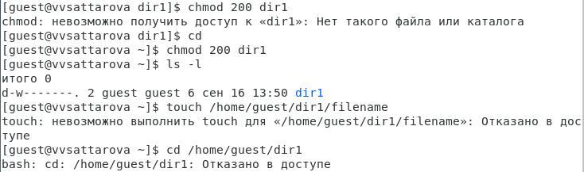
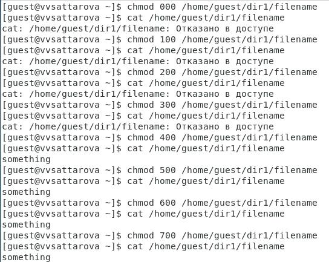
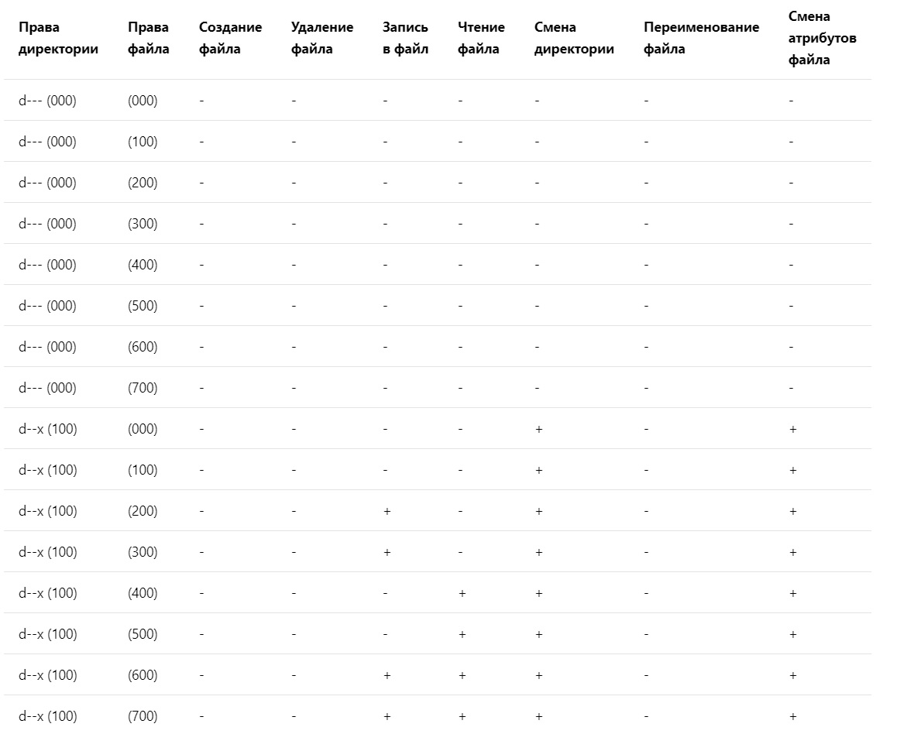

---
## Front matter
lang: ru-RU
title: Презентация к лабораторной работе 2
subtitle: Дискреционное разграничение прав в Linux. Основные атрибуты
author:
  - Саттарова В.В.
institute:
  - Российский университет дружбы народов, Москва, Россия
date: 16 сентября 2023

## i18n babel
babel-lang: russian
babel-otherlangs: english

## Formatting pdf
toc: false
toc-title: Содержание
slide_level: 2
aspectratio: 169
section-titles: true
theme: metropolis
mainfont: PT Serif
romanfont: PT Serif
sansfont: PT Sans
monofont: PT Mono
header-includes:
 - \metroset{progressbar=frametitle,sectionpage=progressbar,numbering=fraction}
 - '\makeatletter'
 - '\beamer@ignorenonframefalse'
 - '\makeatother'
---

# Информация

## Докладчик

:::::::::::::: {.columns align=center}
::: {.column width="70%"}

  * Саттарова Вита Викторовна
  * студент НФИбд-02-20, 1032201655
  * Российский университет дружбы народов

:::
::::::::::::::

# Вводная часть

## Актуальность и прагматика

- Практические навыки работы в консоли с атрибутами файлов помогут при выполнении дальнейших работ и научать создавать ограниченный доступ пользователям к файлам и директориям
- Таблицы помогут лучше понять, при каких атрибутах какие действия можно выполнять
- Дискреционное разграничения доступа в современных системах помогает обеспечить безопасность системы при работе большого числа пользоваетлей

## Цели 

- Получить практические навыки работы в консоли с атрибутами файлов.
- Закрепить теоретические основы дискреционного разграничения доступа в современных системах с открытым кодом на базе ОС Linux.

## Задачи

- Вспомнить теоретические основы атрибутов файлов и директорий в ОС Linux.
- Выполнить все пункты, указанные в методических рекомендациях к лабораторной работе.
- Создать две таблицы: "Установленные права и разрешённые действия" и "Минимальные права для совершения операций".
- Проанализировать, за что отвечают разные атрибуты доступа.  
- Написать отчёт с ответами на вопросы, заданные в пунктах для выполнения в методических рекомендациях к лабораторной работе.

## Исследование выполнения всех возможных действий для одного вида атрибутов

## Исследование одного действия при различных атрибутах

## Часть одной из сделанных таблиц

# Результаты

- Освежены в памяти теоретические основы атрибутов файлов и директорий в ОС Linux;
- Созданы две таблицы: "Установленные права и разрешённые действия" и "Минимальные права для совершения операций".
- Был проведён анализ, за что отвечают разные атрибуты доступа.  
- Написан отчёт с ответами на вопросы, заданные в пунктах для выполнения в методических рекомендациях к лабораторной работе.
