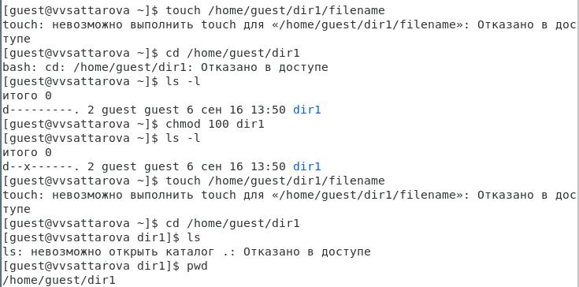

---
## Front matter
lang: ru-RU
title: "Отчёт по лабораторной работе №2 по предмету Информационная безопасность"
subtitle: "Дискреционное разграничение прав в Linux. Основные атрибуты"
author: "Саттарова Вита Викторовна"
teacher: "Кулябов Дмитрий Сергеевич"

# Formatting
toc-title: "Содержание"
toc: true # Table of contents
toc_depth: 2
iof-title: "Список изображений"
lof: true # List of figures
iof-title: "Список таблиц"
lot: true # List of tables
fontsize: 12pt
linestretch: 1.5
papersize: a4paper
documentclass: scrreprt
polyglossia-lang: russian
polyglossia-otherlangs: english
mainfont: PT Serif
romanfont: PT Serif
sansfont: PT Sans
monofont: PT Mono
mainfontoptions: Ligatures=TeX
romanfontoptions: Ligatures=TeX
sansfontoptions: Ligatures=TeX,Scale=MatchLowercase
monofontoptions: Scale=MatchLowercase
indent: true
pdf-engine: lualatex
header-includes:
  - \linepenalty=10 # the penalty added to the badness of each line within a paragraph (no associated penalty node) Increasing the value makes tex try to have fewer lines in the paragraph.
  - \interlinepenalty=0 # value of the penalty (node) added after each line of a paragraph.
  - \hyphenpenalty=50 # the penalty for line breaking at an automatically inserted hyphen
  - \exhyphenpenalty=50 # the penalty for line breaking at an explicit hyphen
  - \binoppenalty=700 # the penalty for breaking a line at a binary operator
  - \relpenalty=500 # the penalty for breaking a line at a relation
  - \clubpenalty=150 # extra penalty for breaking after first line of a paragraph
  - \widowpenalty=150 # extra penalty for breaking before last line of a paragraph
  - \displaywidowpenalty=50 # extra penalty for breaking before last line before a display math
  - \brokenpenalty=100 # extra penalty for page breaking after a hyphenated line
  - \predisplaypenalty=10000 # penalty for breaking before a display
  - \postdisplaypenalty=0 # penalty for breaking after a display
  - \floatingpenalty = 20000 # penalty for splitting an insertion (can only be split footnote in standard LaTeX)
  - \raggedbottom # or \flushbottom
  - \usepackage{float} # keep figures where there are in the text
  - \floatplacement{figure}{H} # keep figures where there are in the text
---

# Цели и задачи работы

**Цели:**

- Получить практические навыки работы в консоли с атрибутами файлов.
- Закрепить теоретические основы дискреционного разграничения доступа в современных системах с открытым кодом на базе ОС Linux.

**Задачи:**

- Вспомнить теоретические основы атрибутов файлов и директорий в ОС Linux.
- Выполнить все пункты, указанные в методических рекомендациях к лабораторной работе.
- Создать две таблицы: "Установленные права и разрешённые действия" и "Минимальные права для совершения операций".
- Проанализировать, за что отвечают разные атрибуты доступа.  
- Написать отчёт с ответами на вопросы, заданные в пунктах для выполнения в методических рекомендациях к лабораторной работе.

# Объект и предмет исследования

**Объект исследования:** разграничение доступа в ОС Linux

**Предмет исследования:** атрибуты доступа директории, атрибуты доступа файла, минимальные права для совершения операций с файлами и директориями

# Условные обозначения и термины

**Условные обозначения**

- ОС - операционная система

**Термины**

- Дискреционное разграничение доступа
- Права/атрибуты доступа
- Директория

# Задание

*Постарайтесь последовательно выполнить все пункты, занося ваши ответы на поставленные вопросы и замечания в отчёт.*

1. В установленной при выполнении предыдущей лабораторной работы операционной системе создайте учётную запись пользователя guest (использую учётную запись администратора): `useradd guest`.

2. Задайте пароль для пользователя guest (использую учётную запись администратора): `passwd guest`.

3. Войдите в систему от имени пользователя guest: `su guest`.
 
4. Определите директорию, в которой вы находитесь, командой `pwd`. Сравните её с приглашением командной строки. Определите, является ли она вашей домашней директорией? Если нет, зайдите в домашнюю директорию: `cd`.

5. Уточните имя вашего пользователя командой `whoami`.

6. Уточните имя вашего пользователя, его группу, а также группы, куда входит пользователь, командой `id`. Выведенные значения uid, gid и др. запомните. Сравните вывод `id` с выводом команды `groups`.

7. Сравните полученную информацию об имени пользователя с данными, выводимыми в приглашении командной строки.

8. Просмотрите файл */etc/passwd* командой `cat /etc/passwd`. Найдите в нём свою учётную запись. Определите uid пользователя. Определите gid пользователя. Сравните найденные значения с полученными в предыдущих пунктах. **Замечание:** в случае, когда вывод команды не умещается на одном экране монитора, используйте прокрутку вверх–вниз либо программу `grep` в качестве фильтра для вывода только строк, содержащих определённые буквенные сочетания: `cat /etc/passwd | grep guest`.

9. Определите существующие в системе директории командой `ls -l /home/`. Удалось ли вам получить список поддиректорий директории */home*? Какие права установлены на директориях?

10. Проверьте, какие расширенные атрибуты установлены на поддиректориях, находящихся в директории */home*, командой: `lsattr /home`. Удалось ли вам увидеть расширенные атрибуты директории? Удалось ли вам увидеть расширенные атрибуты директорий других пользователей?

11. Создайте в домашней директории поддиректорию dir1 командой `mkdir dir1`. Определите командами `ls -l` и `lsattr`, какие права доступа и расширенные атрибуты были выставлены на директорию dir1.

12. Снимите с директории dir1 все атрибуты командой `chmod 000 dir1` и проверьте с её помощью правильность выполнения команды `ls -l`.

13. Попытайтесь создать в директории dir1 файл file1 командой `echo "test" > /home/guest/dir1/file1`. Объясните, почему вы получили отказ в выполнении операции по созданию файла? Оцените, как сообщение об ошибке отразилось на создании файла? Проверьте командой `ls -l /home/guest/dir1`, действительно ли файл file1 не находится внутри директории dir1.

14. Заполните таблицу **«Установленные права и разрешённые действия»**, выполняя действия от имени владельца директории (файлов), определив опытным путём, какие операции разрешены, а какие нет. Если операция разрешена, занесите в таблицу знак «+», если не разрешена, знак «-».

**Замечание 1:** при заполнении таблицы рассматриваются не все атрибуты файлов и директорий, а лишь «первые три»: г, w, х, для «владельца». Остальные атрибуты также важны, однако проверка всех атрибутов при всех условиях значительно увеличила бы таблицу: так 9 атрибутов на директорию и 9 атрибутов на файл дают 218 строк без учёта дополнительных атрибутов, плюс таблица была бы расширена по количеству столбцов, так как все приведённые операции необходимо было бы повторить ещё как минимум для двух пользователей: входящего в группу владельца файла и не входящего в неё. После полного заполнения таблицы и анализа полученных данных нам удалось бы выяснить, что заполнение её в таком виде излишне. Можно разделить большую таблицу на несколько малых независимых таблиц. В данном примере предлагается рассмотреть 3+3 атрибута, т.е. 2^6 = 64 варианта.

**Замечание 2:** в ряде действий при выполнении команды удаления файла вы можете столкнуться с вопросом: *«Удалить защищённый от записи пустой обычный файл dir1/file1?»* Обратите внимание, что наличие этого вопроса не позволяет сделать правильный вывод о том, что файл можно удалить. В ряде случаев, при ответе «y» (да) на указанный вопрос, возможно получить другое сообщение: *«невозможно удалить dirl /file1: Отказано в доступе»*.

15. На основании заполненной таблицы определите те или иные минимально необходимые права для выполнения операций внутри директории dir1, заполните таблицу **"Минимальные права для совершения операций"**.
 
Более подробно о работе см. в [@course:infosec_lab2](bib/cite.bib).

# Теоретическое введение

## Основы работы с уровнями доступа в ОС Linux

**Права доступа определяют**, какие действия конкретный пользователь может или не может совершать с определенным файлами и каталогами.

Есть 3 вида разрешений. Они определяют права пользователя на 3 действия: чтение, запись и выполнение. В Linux эти действия обозначаются вот так:

- r — read (чтение) — право просматривать содержимое файла;
- w — write (запись) — право изменять содержимое файла;
- x — execute (выполнение) — право запускать файл, если это программа или скрипт.

У каждого файла есть 3 группы пользователей, для которых можно устанавливать права доступа. 

- owner (владелец) — отдельный человек, который владеет файлом. Обычно это тот, кто создал файл, но владельцем можно сделать и кого-то другого.
- group (группа) — пользователи с общими заданными правами.
- others (другие) — все остальные пользователи, не относящиеся к группе и не являющиеся владельцами. 

Чтобы посмотреть права доступа к файлу, нужно вызвать команду `ls` с опцией `-l`. Эта опция отвечает за вывода списка в длинном формате.

В выводе первые 10 символов вывода показывают разрешения файла. 

- Первый символ определяет тип файла. Если первый символ — прочерк -, то это обычный файл. Если первый символ d, то это каталог.
- Следующие 3 символа показывают разрешения для владельца. Буква означает наличие разрешения, а прочерк - — его отсутствие. В нашем примере у владельца есть все разрешения (чтение, запись и выполнение).
- Следующие 3 символа показывают разрешения для группы. В этом примере у членов группы есть разрешение на чтение, но нет разрешений на запись и выполнение. Обратите внимание, порядок записи разрешений всегда такой: чтение, запись, выполнение. 
- Последние 3 символа показывают разрешения для всех остальных пользователей. В этом примере у них есть только разрешение на выполнение.  

Для изменения прав доступа к файлу или каталога используется команда `chmod` (от англ. change mode). Эта команда меняет биты режима файла — если совсем просто, это индикатор разрешений. 

Аргументы команды `chmod`, отвечающие за разрешение, состоят из 3 компонентов:

- Для кого мы меняем разрешение? Обозначается первыми буквами слов: user (пользователь, он же владелец), group (группа), others (другие), all (все). 
- Мы предоставляем или отзываем разрешения? Обозначается плюсом +, если предоставляем, минусом -, если отзываем. 
- Какое разрешение мы хотим изменить? Чтение (r), запись (w), выполнение (x). 

Для разрешений можно установить сокращенные формы записи. С их помощью выдавать разрешения будет быстрее. Сокращения полезны, когда нужно регулярно применять набор разрешений для определенных файлов. Запись сокращений основана на двоичной системе счисления переводимой в восьмеричную. Каждый из параметров r, w, x может как отсутствовать, так и присутствовать, что записывается с помощью 0 или 1. полученный результат переводится в число от 0 до 7 и обозначает права соответствующей группы пользователей, таким образом вместо записи 9 символов r, w, x записываются три цифры от 0 до 7.  

Для каталогов можно устанавливать те же права доступа, разница в выводе в наличии или отсутствии на месте первого символа d. 

Более подробно о работе см. в [@permissions](bib/cite.bib).

# Техническое оснащение и выбранные методы проведения работы

**Техническое оснащение**

- Ноутбук
- CentOS
- Интернет

**Методы проведения работы**

- Изучение методической информации
- Выполнение заданий в соответствии с указаниями
- Анализ результатов
- Обобщение полученных результатов в табличном виде
- Обобщение проведённой деятельности

# Выполнение лабораторной работы и полученные результаты

1. Скачала и ознакомилась с методическими указаниями к лабораторной работе (рис. @fig:001).

{ #fig:001 width=100% }

2. Выполнила следующие пункты задания: (рис. @fig:002) 

- создала учётную запись пользователя guest (используя учётную запись администратора): `useradd guest`;

- задала пароль для пользователя guest : `passwd guest`.

{ #fig:002 width=100% }

3. Выполнила следующие пункты задания: (рис. @fig:003)

- вошла в систему от имени пользователя guest: `su guest`;
 
- определила директорию, в которой я нахожусь, командой `pwd` - /root, сравнила её с приглашением командной строки: [guest@vvsattarova root], определила, является ли она домашней директорией - нет, в этом случае зашла в домашнюю директорию: [guest@vvsattarova ~];

- уточнила имя пользователя командой `whoami` - guest.

{ #fig:003 width=100% }

4. Выполнила следующие пункты задания: (рис. @fig:004)

- уточнила имя пользователя - 1001(guest), его группу - 1001(guest), а также группы - 1001(guest), куда входит пользователь, командой `id`, сравнила вывод `id` с выводом команды `groups`: группы совпадают;

- сравнила полученную информацию об имени пользователя с данными, выводимыми в приглашении командной строки - [guest@vvsattarova ~], соответственно, имя пользователя совпадает с именем в приглашении командной строки;

- просмотрела файл */etc/passwd* командой `cat /etc/passwd | grep guest`, нашла в нём свою учётную запись guest, определила uid = 1001, определила gid = 1001, сравнила найденные значения с полученными в предыдущих пунктах - значения совпадают;

- определила существующие в системе директории командой `ls -l /home/`: vvsattarova, root, guest, - удалось получить список поддиректорий директории */home*, на директориях установлены следующие права: d700 - guest, d770 - root, d700 - vvsattarova.

{ #fig:004 width=100% }

5. Выполнила следующие пункты задания: (рис. @fig:005)

- проверила, какие расширенные атрибуты установлены на поддиректориях, находящихся в директории */home*, командой: `lsattr /home`, удалось увидеть расширенные атрибуты директории - ----------------, не удалось увидеть расширенные атрибуты директорий других пользователей;

- создала в домашней директории поддиректорию dir1 командой `mkdir dir1`, определила командами `ls -l` и `lsattr`, какие права доступа и расширенные атрибуты были выставлены на директорию dir1: drwxrwxr-x и ----------------;

- сняла с директории dir1 все атрибуты командой `chmod 000 dir1` и проверила с её помощью правильность выполнения команды `ls -l`.

{ #fig:005 width=100% }

6. Попыталась создать в директории dir1 файл file1 командой `echo "test" > /home/guest/dir1/file1`. Получила отказ в выполнении операции по созданию файла, в связи с атрибутами d---, которые не позволяют это сделать, оценила, как сообщение об ошибке отразилось на создании файла - файл не был создан, проверила командой `ls -l /home/guest/dir1`, что файл file1 действительно не находится внутри директории dir1. (рис. @fig:006)

{ #fig:006 width=100% }

7. Заполнила таблицу **«Установленные права и разрешённые действия»**, выполняя действия от имени владельца директории (файлов), определив опытным путём, какие операции разрешены, а какие нет. Если операция разрешена, занесите в таблицу знак «+», если не разрешена, знак «-». 

*Комментарий:* сначала я исследовала атрибуты проходясь по всем действиям от заданных атрибутов, которые изменяла при окончании проверки необходимых действий, однако такой подход оказался сложным для анализа, поэтому впоследствии я анализировала по одному дествию для всех вариантов атрибутов. Также в ходе исследования выяснилось, что лишь для двух действий: запись в файл и просмотр файла, - необходимо изменять атрибуты файлов, остальные действия зависят только от атрибутов директории, поэтому достаточно было просто изменять атрибуты директории. (рис. @fig:007) (рис. @fig:008) (рис. @fig:009) (рис. @fig:010) (рис. @fig:011) (рис. @fig:012) (рис. @fig:013) (рис. @fig:014) (рис. @fig:015) (Таблица @tbl:001)

{ #fig:007 width=100% }

{ #fig:008 width=100% }

{ #fig:009 width=100% }

{ #fig:010 width=100% }

{ #fig:011 width=100% }

{ #fig:012 width=100% }

{ #fig:013 width=100% }

{ #fig:014 width=100% }

{ #fig:015 width=100% }

: Установленные права и разрешённые действия {#tbl:001}

|Права директории|Права файла|Создание файла| Удаление файла | Запись в файл | Чтение файла | Смена директории | Переименование файла | Смена атрибутов файла |
|----------------|-----------|--------------|----------------|---------------|--------------|------------------|----------------------|-----------------------|
|   d--- (000)   |   (000)   |       -      |        -       |       -       |       -      |         -        |           -          |            -          |
|   d--- (000)   |   (100)   |       -      |        -       |       -       |       -      |         -        |           -          |            -          |
|   d--- (000)   |   (200)   |       -      |        -       |       -       |       -      |         -        |           -          |            -          |
|   d--- (000)   |   (300)   |       -      |        -       |       -       |       -      |         -        |           -          |            -          |
|   d--- (000)   |   (400)   |       -      |        -       |       -       |       -      |         -        |           -          |            -          |
|   d--- (000)   |   (500)   |       -      |        -       |       -       |       -      |         -        |           -          |            -          |
|   d--- (000)   |   (600)   |       -      |        -       |       -       |       -      |         -        |           -          |            -          |
|   d--- (000)   |   (700)   |       -      |        -       |       -       |       -      |         -        |           -          |            -          |
|   d--x (100)   |   (000)   |       -      |        -       |       -       |       -      |         +        |           -          |            +          |
|   d--x (100)   |   (100)   |       -      |        -       |       -       |       -      |         +        |           -          |            +          |
|   d--x (100)   |   (200)   |       -      |        -       |       +       |       -      |         +        |           -          |            +          |
|   d--x (100)   |   (300)   |       -      |        -       |       +       |       -      |         +        |           -          |            +          |
|   d--x (100)   |   (400)   |       -      |        -       |       -       |       +      |         +        |           -          |            +          |
|   d--x (100)   |   (500)   |       -      |        -       |       -       |       +      |         +        |           -          |            +          |
|   d--x (100)   |   (600)   |       -      |        -       |       +       |       +      |         +        |           -          |            +          |
|   d--x (100)   |   (700)   |       -      |        -       |       +       |       +      |         +        |           -          |            +          |
|   d-w- (200)   |   (000)   |       -      |        -       |       -       |       -      |         -        |           -          |            -          |
|   d-w- (200)   |   (100)   |       -      |        -       |       -       |       -      |         -        |           -          |            -          |
|   d-w- (200)   |   (200)   |       -      |        -       |       -       |       -      |         -        |           -          |            -          |
|   d-w- (200)   |   (300)   |       -      |        -       |       -       |       -      |         -        |           -          |            -          |
|   d-w- (200)   |   (400)   |       -      |        -       |       -       |       -      |         -        |           -          |            -          |
|   d-w- (200)   |   (500)   |       -      |        -       |       -       |       -      |         -        |           -          |            -          |
|   d-w- (200)   |   (600)   |       -      |        -       |       -       |       -      |         -        |           -          |            -          |
|   d-w- (200)   |   (700)   |       -      |        -       |       -       |       -      |         -        |           -          |            -          |
|   d-wx (300)   |   (000)   |       +      |        +       |       -       |       -      |         +        |           +          |            +          |
|   d-wx (300)   |   (100)   |       +      |        +       |       -       |       -      |         +        |           +          |            +          |
|   d-wx (300)   |   (200)   |       +      |        +       |       +       |       -      |         +        |           +          |            +          |
|   d-wx (300)   |   (300)   |       +      |        +       |       +       |       -      |         +        |           +          |            +          |
|   d-wx (300)   |   (400)   |       +      |        +       |       -       |       +      |         +        |           +          |            +          |
|   d-wx (300)   |   (500)   |       +      |        +       |       -       |       +      |         +        |           +          |            +          |
|   d-wx (300)   |   (600)   |       +      |        +       |       +       |       +      |         +        |           +          |            +          |
|   d-wx (300)   |   (700)   |       +      |        +       |       +       |       +      |         +        |           +          |            +          |
|   dr-- (400)   |   (000)   |       -      |        -       |       -       |       -      |         -        |           -          |            -          |
|   dr-- (400)   |   (100)   |       -      |        -       |       -       |       -      |         -        |           -          |            -          |
|   dr-- (400)   |   (200)   |       -      |        -       |       -       |       -      |         -        |           -          |            -          |
|   dr-- (400)   |   (300)   |       -      |        -       |       -       |       -      |         -        |           -          |            -          |
|   dr-- (400)   |   (400)   |       -      |        -       |       -       |       -      |         -        |           -          |            -          |
|   dr-- (400)   |   (500)   |       -      |        -       |       -       |       -      |         -        |           -          |            -          |
|   dr-- (400)   |   (600)   |       -      |        -       |       -       |       -      |         -        |           -          |            -          |
|   dr-- (400)   |   (700)   |       -      |        -       |       -       |       -      |         -        |           -          |            -          |
|   dr-x (500)   |   (000)   |       -      |        -       |       -       |       -      |         +        |           -          |            +          |
|   dr-x (500)   |   (100)   |       -      |        -       |       -       |       -      |         +        |           -          |            +          |
|   dr-x (500)   |   (200)   |       -      |        -       |       +       |       -      |         +        |           -          |            +          |
|   dr-x (500)   |   (300)   |       -      |        -       |       +       |       -      |         +        |           -          |            +          |
|   dr-x (500)   |   (400)   |       -      |        -       |       -       |       +      |         +        |           -          |            +          |
|   dr-x (500)   |   (500)   |       -      |        -       |       -       |       +      |         +        |           -          |            +          |
|   dr-x (500)   |   (600)   |       -      |        -       |       +       |       +      |         +        |           -          |            +          |
|   dr-x (500)   |   (700)   |       -      |        -       |       +       |       +      |         +        |           -          |            +          |
|   drw- (600)   |   (000)   |       -      |        -       |       -       |       -      |         -        |           -          |            -          |
|   drw- (600)   |   (100)   |       -      |        -       |       -       |       -      |         -        |           -          |            -          |
|   drw- (600)   |   (200)   |       -      |        -       |       -       |       -      |         -        |           -          |            -          |
|   drw- (600)   |   (300)   |       -      |        -       |       -       |       -      |         -        |           -          |            -          |
|   drw- (600)   |   (400)   |       -      |        -       |       -       |       -      |         -        |           -          |            -          |
|   drw- (600)   |   (500)   |       -      |        -       |       -       |       -      |         -        |           -          |            -          |
|   drw- (600)   |   (600)   |       -      |        -       |       -       |       -      |         -        |           -          |            -          |
|   drw- (600)   |   (700)   |       -      |        -       |       -       |       -      |         -        |           -          |            -          |
|   drwx (700)   |   (000)   |       +      |        +       |       -       |       -      |         +        |           +          |            +          |
|   drwx (700)   |   (100)   |       +      |        +       |       -       |       -      |         +        |           +          |            +          |
|   drwx (700)   |   (200)   |       +      |        +       |       +       |       -      |         +        |           +          |            +          |
|   drwx (700)   |   (300)   |       +      |        +       |       +       |       -      |         +        |           +          |            +          |
|   drwx (700)   |   (400)   |       +      |        +       |       -       |       +      |         +        |           +          |            +          |
|   drwx (700)   |   (500)   |       +      |        +       |       -       |       +      |         +        |           +          |            +          |
|   drwx (700)   |   (600)   |       +      |        +       |       +       |       +      |         +        |           +          |            +          |
|   drwx (700)   |   (700)   |       +      |        +       |       +       |       +      |         +        |           +          |            +          |

1. На основании заполненной таблицы и дополнительных проверок определила те или иные минимально необходимые права для выполнения операций внутри директории dir1, заполнила таблицу **"Минимальные права для совершения операций"**. (рис. @fig:016) (Таблица @tbl:002)

{ #fig:016 width=100% }

: Минимальные права для совершения операций {#tbl:002}

|        Операция        | Минимальные права на директорию | Минимальные права на файл |
|------------------------|---------------------------------|---------------------------|
|     Создание файла     |            d-wx (300)           |         --- (000)         |
|     Удаление файла     |            d-wx (300)           |         --- (000)         |
|      Чтение файла      |            d--x (100)           |         r-- (400)         |
|      Запись в файл     |            d--x (100)           |         -w- (200)         |
|  Переименование файла  |            d-wx (300)           |         --- (000)         | 
| Создание поддиректории |            d-wx (300)           |         --- (000)         |
| Удаление поддиректории |            d-wx (300)           |         --- (000)         |

# Анализ результатов

Полученные таблицы помогают лучше понять, при каких атрибутах какие действия можно выполнять.

# Заключение и выводы

Таким образом, в ходе выполнения лабораторной работы было сделано следующее: 

- Вспомнены теоретические основы атрибутов файлов и директорий в ОС Linux;
- Созданы две таблицы: "Установленные права и разрешённые действия" и "Минимальные права для совершения операций".
- Был проведён анализ, за что отвечают разные атрибуты доступа.  
- Написан отчёт с ответами на вопросы, заданные в пунктах для выполнения в методических рекомендациях к лабораторной работе.

# Список литературы

@course:infosec_lab2

@permissions