---
## Front matter
lang: ru-RU
title: "Отчёт по лабораторной работе №3 по предмету Информационная безопасность"
subtitle: "Дискреционное разграничение прав в Linux. Два пользователя"
author: "Саттарова Вита Викторовна"
teacher: "Кулябов Дмитрий Сергеевич"

## Generic otions
lang: ru-RU
toc-title: "Содержание"

## Bibliography
bibliography: bib/cite.bib
csl: pandoc/csl/gost-r-7-0-5-2008-numeric.csl

## Pdf output format
toc: true # Table of contents
toc-depth: 2
lof: true # List of figures
lot: true # List of tables
fontsize: 12pt
linestretch: 1.5
papersize: a4
documentclass: scrreprt
## I18n polyglossia
polyglossia-lang:
  name: russian
  options:
	- spelling=modern
	- babelshorthands=true
polyglossia-otherlangs:
  name: english
## I18n babel
babel-lang: russian
babel-otherlangs: english
## Fonts
mainfont: PT Serif
romanfont: PT Serif
sansfont: PT Sans
monofont: PT Mono
mainfontoptions: Ligatures=TeX
romanfontoptions: Ligatures=TeX
sansfontoptions: Ligatures=TeX,Scale=MatchLowercase
monofontoptions: Scale=MatchLowercase,Scale=0.9
## Biblatex
biblatex: true
biblio-style: "gost-numeric"
biblatexoptions:
  - parentracker=true
  - backend=biber
  - hyperref=auto
  - language=auto
  - autolang=other*
  - citestyle=gost-numeric
## Pandoc-crossref LaTeX customization
figureTitle: "Рис."
tableTitle: "Таблица"
listingTitle: "Листинг"
lofTitle: "Список иллюстраций"
lotTitle: "Список таблиц"
lolTitle: "Листинги"
## Misc options
indent: true
header-includes:
  - \usepackage{indentfirst}
  - \usepackage{float} # keep figures where there are in the text
  - \floatplacement{figure}{H} # keep figures where there are in the text
---

# Цели и задачи работы

**Цели:**

- Получить практические навыки работы в консоли с атрибутами файлов для групп пользователей.
- Закрепить практические навыки работы в консоли с атрибутами файлов.
- Закрепить теоретические основы дискреционного разграничения доступа в современных системах с открытым кодом на базе ОС Linux.

**Задачи:**

- Создать двух пользователей в одной группе, вспомнить теоретические основы работы с пользователями в Linux.
- Вспомнить теоретические основы атрибутов файлов и директорий в ОС Linux.
- Выполнить все пункты, указанные в методических рекомендациях к лабораторной работе.
- Создать две таблицы: **"Установленные права и разрешённые действия для групп"** и **"Минимальные права для совершения операций от имени пользователей входящих в группу"**.
- Проанализировать, за что отвечают разные атрибуты доступа.  
- Написать отчёт с ответами на вопросы, заданные в пунктах для выполнения в методических рекомендациях к лабораторной работе.

# Объект и предмет исследования

**Объект исследования:** разграничение доступа в ОС Linux для групп

**Предмет исследования:** группа пользователей, атрибуты доступа директории, атрибуты доступа файла, минимальные права для совершения операций с файлами и директориями

# Условные обозначения и термины

**Условные обозначения**

- ОС - операционная система

**Термины**

- Дискреционное разграничение доступа
- Права/атрибуты доступа
- Директория

# Задание

1. В установленной при выполнении предыдущей лабораторной работы операционной системе создайте учётную запись пользователя guest (использую учётную запись администратора): `useradd guest`.

2. Задайте пароль для пользователя guest (использую учётную запись администратора): `passwd guest`.

3. Аналогично создайте второго пользователя guest2.

4. Добавьте пользователя guest2 в группу guest: `gpasswd -a guest2 guest`.

5. Осуществите вход в систему от двух пользователей на двух разных консолях: guest на первой консоли и guest2 на второй консоли.

6. Для обоих пользователей командой `pwd` определите директорию, в которой вы находитесь. Сравните её с приглашениями командной строки.

7. Уточните имя вашего пользователя, его группу, кто входит в неё и к каким группам принадлежит он сам. Определите командами `groups guest` и `groups guest2`, в какие группы входят пользователи guest и guest2. Сравните вывод команды `groups` с выводом команд `id -Gn` и `id -G`.

8. Сравните полученную информацию с содержимым файла */etc/group*. Просмотрите файл командой `cat /etc/group`.

9. От имени пользователя guest2 выполните регистрацию пользователя guest2 в группе guest командой `newgrp guest`.

10. От имени пользователя guest измените права директории */home/guest*, разрешив все действия для пользователей группы: `chmod g+rwx /home/guest`.

11. От имени пользователя guest снимите с директории */home/guest/dir1* все атрибуты командой `chmod 000 dirl` и проверьте правильность снятия атрибутов.

12. Меняя атрибуты у директории dir1 и файла file1 от имени пользователя guest и делая проверку от пользователя guest2, заполните табл. **"Установленные права и разрешённые действия для групп"**, определив опытным путём, какие операции разрешены, а какие нет. Если операция разрешена, занесите в таблицу знак «+», если не разрешена, знак «-». Сравните полученную таблицу с таблицей из лабораторной работы № 2.

13. На основании заполненной таблицы определите те или иные минимально необходимые права для выполнения пользователем guest2 операций внутри директории dir1 и заполните табл. **"Минимальные права для совершения операций от имени пользователей входящих в группу"**.
 
Более подробно о работе см. в [@course:infosec_lab3](bib/cite.bib).

# Теоретическое введение

## Основы работы с группами и пользователями в ОС Linux

Добавление пользователя осуществляется при помощи команды `useradd`.  Эта команда создаст в системе нового пользователя. Чтобы изменить настройки создаваемого пользователя, вы можете использовать ключи, например:

-с: Комментарий. В нем вы можете напечатать любой текст.

-d: Название домашнего каталога. По умолчанию название совпадает с именем создаваемого пользователя.

-G: Список вторичных групп в которых будет находится создаваемый пользователь.

Если при создании пользователя не указываются дополнительные ключи, то берутся настройки по умолчанию. Эти настройки вы можете посмотреть выполнив `useradd -D`. Если вас не устраивают такие настройки, вы можете поменять их выполнив `sudo useradd -D -s /bin/bash`, где -s это ключ.

Изменение параметров пользователя происходит с помощью утилиты `usermod`. Изменить пароль пользователю можно при помощи утилиты `passwd`. У неё также есть ключи, например:

-d:	Удалить пароль пользователю. После этого пароль будет пустым, и пользователь сможет входить в систему без предъявления пароля.

-e:	Сделать пароль устаревшим. Это заставит пользователя изменить пароль при следующем входе в систему.

-l:	Заблокировать учетную запись пользователя.

-u:	Разблокировать учетную запись пользователя.

**Получение информации о пользователях**

- `w` – вывод информации (имя пользователя, рабочий терминал, время входа в систему, информацию о потребленных ресурсах CPU и имя запущенной программы) о всех вошедших в систему пользователях.

- `who` – вывод информации (имя пользователя, рабочий терминал, время входа в систему) о всех вошедших в систему пользователях.

- `who am i` или `whoami` или `id` – вывод вашего имени пользователя.

- `users` – вывод имен пользователей, работающих в системе.

- `id имя_пользователя` – вывод о идентификаторах пользователя: его uid, имя_пользователя, gid и имя первичной группы и список групп в которых состоит пользователь

- `groups имя_пользователя` – вывод списка групп в которых состоит пользователь.

Программа `groupadd` создаёт новую группу согласно указанным значениям командной строки и системным значениям по умолчанию. Пример использования: `sudo groupadd testgroup`.

Изменять параметры пользователей и групп можно не только при помощи специальных утилит, но и вручную. Все настройки хранятся в текстовых файлах. В */etc/group*, как очевидно из названия хранится информация о группах. 

Более подробно о работе см. в [@groups](bib/cite.bib).

## Основы работы с уровнями доступа в ОС Linux

**Права доступа определяют**, какие действия конкретный пользователь может или не может совершать с определенным файлами и каталогами.

Есть 3 вида разрешений. Они определяют права пользователя на 3 действия: чтение, запись и выполнение. В Linux эти действия обозначаются вот так:

- r — read (чтение) — право просматривать содержимое файла;
- w — write (запись) — право изменять содержимое файла;
- x — execute (выполнение) — право запускать файл, если это программа или скрипт.

У каждого файла есть 3 группы пользователей, для которых можно устанавливать права доступа. 

- owner (владелец) — отдельный человек, который владеет файлом. Обычно это тот, кто создал файл, но владельцем можно сделать и кого-то другого.
- group (группа) — пользователи с общими заданными правами.
- others (другие) — все остальные пользователи, не относящиеся к группе и не являющиеся владельцами. 

Чтобы посмотреть права доступа к файлу, нужно вызвать команду `ls` с опцией `-l`. Эта опция отвечает за вывода списка в длинном формате.

В выводе первые 10 символов вывода показывают разрешения файла. 

- Первый символ определяет тип файла. Если первый символ — прочерк -, то это обычный файл. Если первый символ d, то это каталог.
- Следующие 3 символа показывают разрешения для владельца. Буква означает наличие разрешения, а прочерк - — его отсутствие. В нашем примере у владельца есть все разрешения (чтение, запись и выполнение).
- Следующие 3 символа показывают разрешения для группы. В этом примере у членов группы есть разрешение на чтение, но нет разрешений на запись и выполнение. Обратите внимание, порядок записи разрешений всегда такой: чтение, запись, выполнение. 
- Последние 3 символа показывают разрешения для всех остальных пользователей. В этом примере у них есть только разрешение на выполнение.  

Для изменения прав доступа к файлу или каталога используется команда `chmod` (от англ. change mode). Эта команда меняет биты режима файла — если совсем просто, это индикатор разрешений. 

Аргументы команды `chmod`, отвечающие за разрешение, состоят из 3 компонентов:

- Для кого мы меняем разрешение? Обозначается первыми буквами слов: user (пользователь, он же владелец), group (группа), others (другие), all (все). 
- Мы предоставляем или отзываем разрешения? Обозначается плюсом +, если предоставляем, минусом -, если отзываем. 
- Какое разрешение мы хотим изменить? Чтение (r), запись (w), выполнение (x). 

Для разрешений можно установить сокращенные формы записи. С их помощью выдавать разрешения будет быстрее. Сокращения полезны, когда нужно регулярно применять набор разрешений для определенных файлов. Запись сокращений основана на двоичной системе счисления переводимой в восьмеричную. Каждый из параметров r, w, x может как отсутствовать, так и присутствовать, что записывается с помощью 0 или 1. полученный результат переводится в число от 0 до 7 и обозначает права соответствующей группы пользователей, таким образом вместо записи 9 символов r, w, x записываются три цифры от 0 до 7.  

Для каталогов можно устанавливать те же права доступа, разница в выводе в наличии или отсутствии на месте первого символа d. 

Более подробно о работе см. в [@permissions](bib/cite.bib).

# Техническое оснащение и выбранные методы проведения работы

**Техническое оснащение**

- Ноутбук
- CentOS
- Интернет

**Методы проведения работы**

- Изучение методической информации
- Выполнение заданий в соответствии с указаниями
- Анализ результатов
- Обобщение полученных результатов в табличном виде
- Обобщение проведённой деятельности

8. Сравните полученную информацию с содержимым файла */etc/group*. Просмотрите файл командой `cat /etc/group`.

9. От имени пользователя guest2 выполните регистрацию пользователя guest2 в группе guest командой `newgrp guest`.

10. От имени пользователя guest измените права директории */home/guest*, разрешив все действия для пользователей группы: `chmod g+rwx /home/guest`.

11. От имени пользователя guest снимите с директории */home/guest/dir1* все атрибуты командой `chmod 000 dirl` и проверьте правильность снятия атрибутов.

12. Меняя атрибуты у директории dir1 и файла file1 от имени пользователя guest и делая проверку от пользователя guest2, заполните табл. **"Установленные права и разрешённые действия для групп"**, определив опытным путём, какие операции разрешены, а какие нет. Если операция разрешена, занесите в таблицу знак «+», если не разрешена, знак «-». Сравните полученную таблицу с таблицей из лабораторной работы № 2.

13. На основании заполненной таблицы определите те или иные минимально необходимые права для выполнения пользователем guest2 операций внутри директории dir1 и заполните табл. **"Минимальные права для совершения операций от имени пользователей входящих в группу"**.

# Выполнение лабораторной работы и полученные результаты

1. Скачала и ознакомилась с методическими указаниями к лабораторной работе (рис. @fig:001).

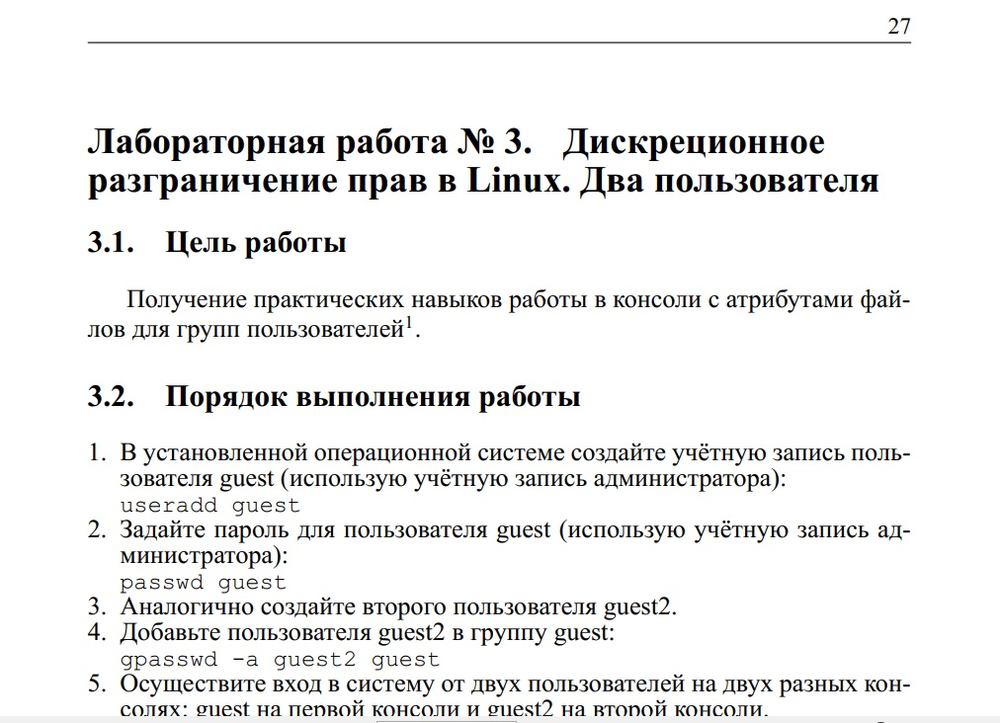{ #fig:001 width=100% }

2. Выполнила следующие пункты задания: (рис. @fig:002) 

- cоздала второго пользователя guest2 и задала ему пароль.

- добавила пользователя guest2 в группу guest: `gpasswd -a guest2 guest`.

*Пункты про создание первого пользователя не выполняла, так как они были выполнены в предыдущей работе.*

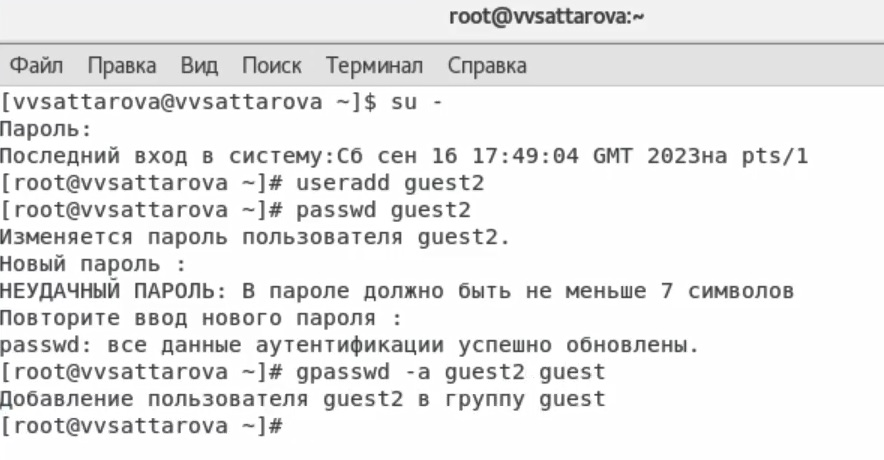{ #fig:002 width=100% }

3. Выполнила следующие пункты задания: (рис. @fig:003)

- осуществила вход в систему от двух пользователей на двух разных консолях: guest на первой консоли и guest2 на второй консоли.

- для обоих пользователей командой `pwd` определила директорию, в которой нахожусь: */home/vvsattarova*, сравнила её с приглашениями командной строки: они совпадают.

- уточнила имя вашего пользователя, его группу, кто входит в неё и к каким группам принадлежит он сам, определила командами `groups guest` и `groups guest2`, в какие группы входят пользователи guest и guest2, сравнила вывод команды `groups` с выводом команд `id -Gn` и `id -G`.

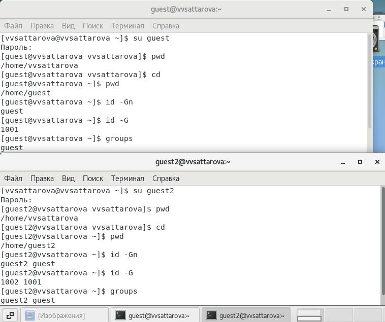{ #fig:003 width=100% }

4. Выполнила следующие пункты задания: (рис. @fig:004)

- сравнила полученную информацию с содержимым файла */etc/group*, просмотрев файл командой `cat /etc/group`.

- от имени пользователя guest2 выполнила регистрацию пользователя guest2 в группе guest командой `newgrp guest`.

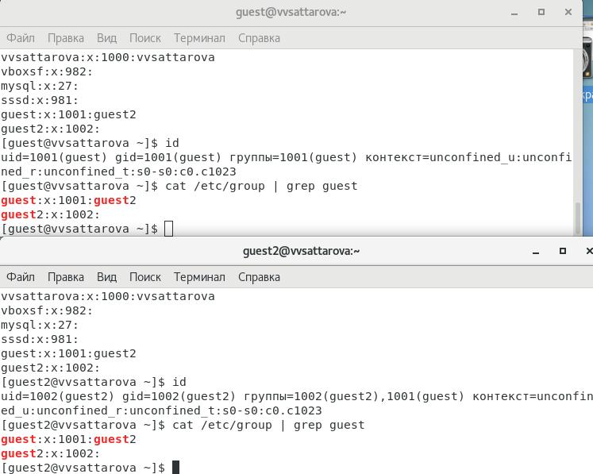{ #fig:004 width=100% }

5. Выполнила следующие пункты задания: (рис. @fig:005)

- от имени пользователя guest изменила права директории */home/guest*, разрешив все действия для пользователей группы: `chmod g+rwx /home/guest`.

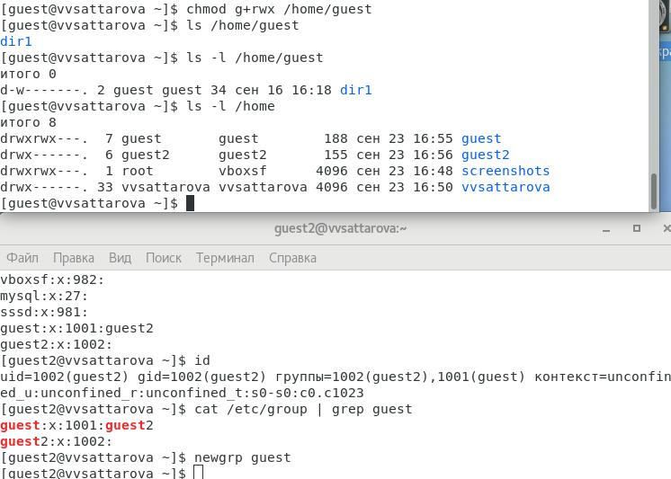{ #fig:005 width=100% }

6. Меняя атрибуты у директории dir1 и файла file1 от имени пользователя guest и делая проверку от пользователя guest2, заполнила табл. **"Установленные права и разрешённые действия для групп"**, определив опытным путём, какие операции разрешены, а какие нет. Сравнила полученную таблицу с таблицей из лабораторной работы № 2: таблицы очень похожи, однако в этой таблице есть дополнительный пункт про просмотр файлов, также важно, что пользователь группы не может менять права доступа к файлу.

(рис. @fig:007) (рис. @fig:008) (рис. @fig:009) (рис. @fig:010) (рис. @fig:011) (рис. @fig:012) (рис. @fig:013) (рис. @fig:014) (рис. @fig:015) (Таблица @tbl:001)

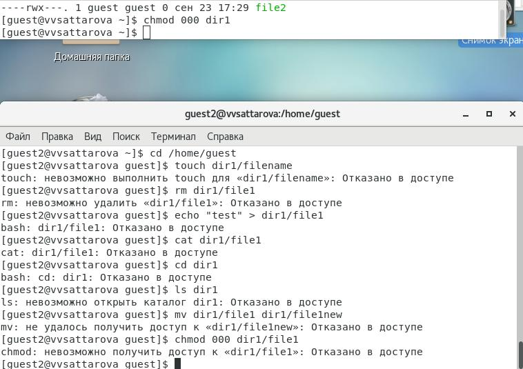{ #fig:007 width=100% }

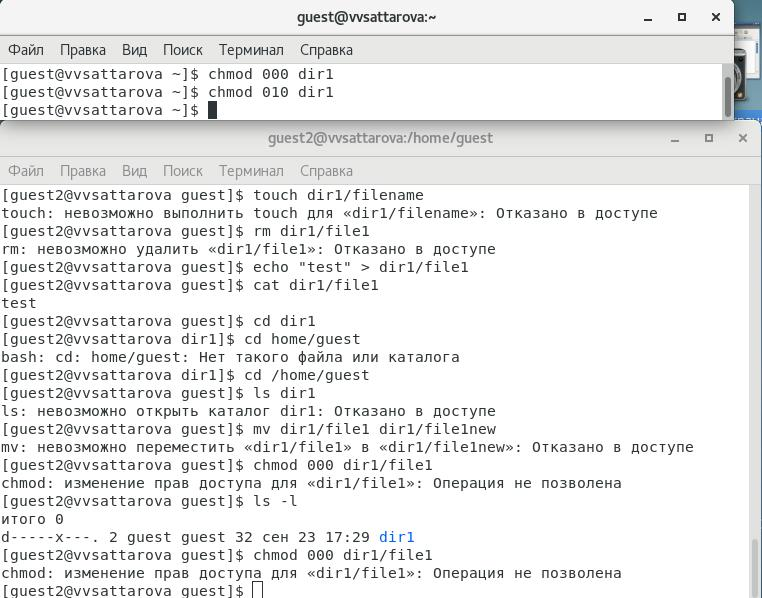{ #fig:008 width=100% }

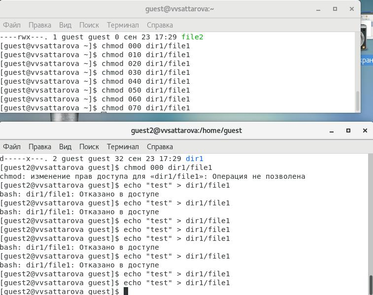{ #fig:009 width=100% }

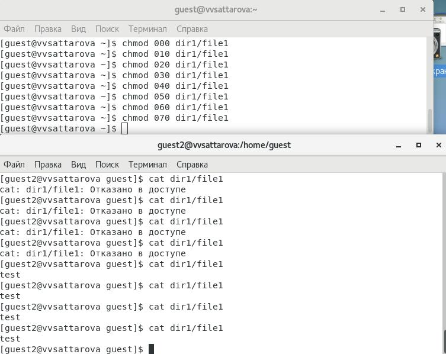{ #fig:010 width=100% }

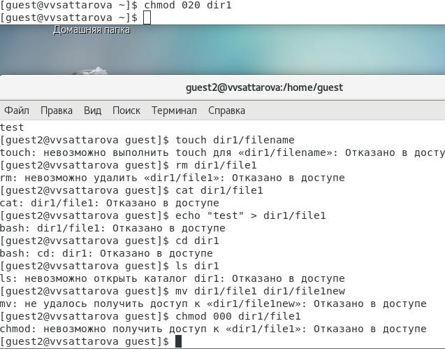{ #fig:011 width=100% }

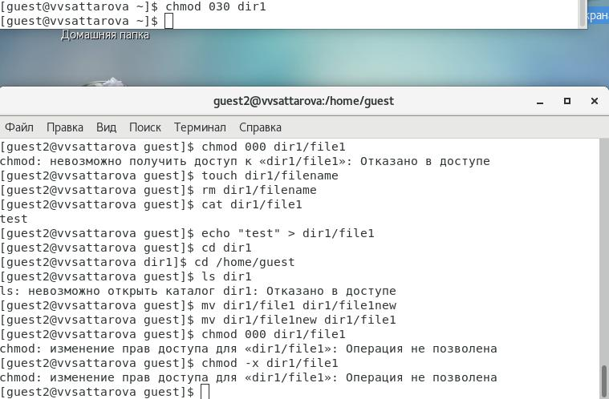{ #fig:012 width=100% }

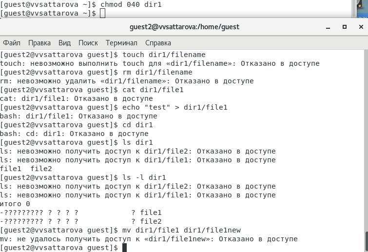{ #fig:013 width=100% }

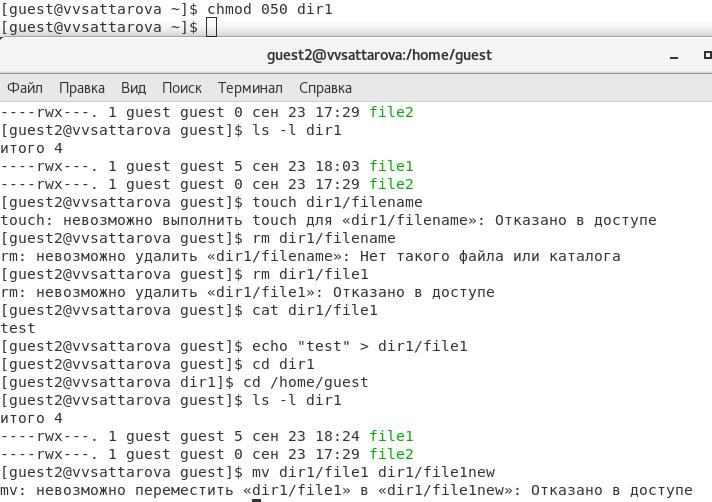{ #fig:014 width=100% }

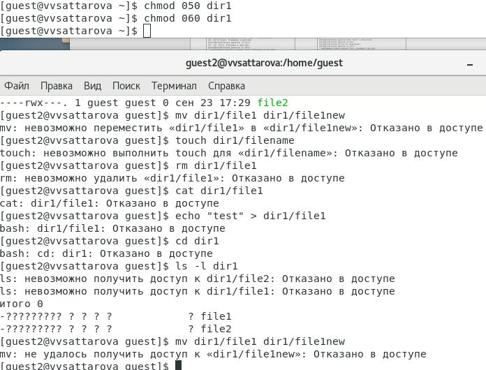{ #fig:015 width=100% }

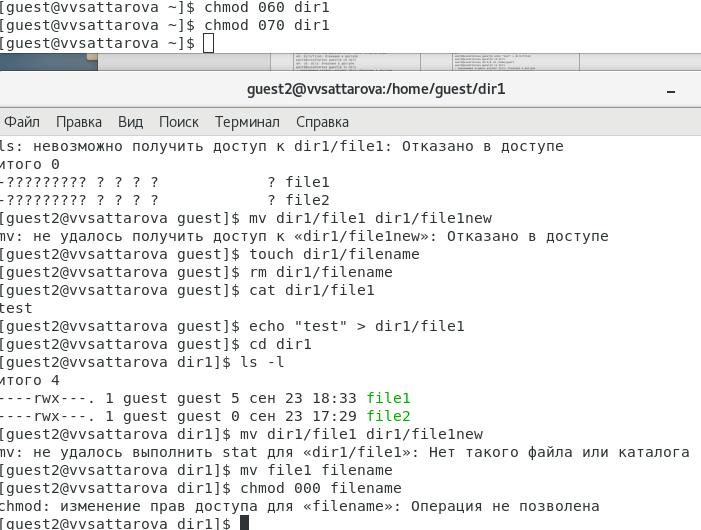{ #fig:016 width=100% }

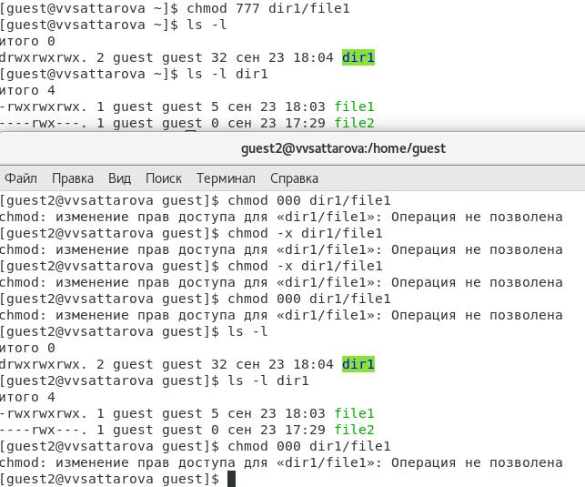{ #fig:017 width=100% }

: Установленные права и разрешённые действия для групп {#tbl:001}

|Права директории|Права файла|Создание файла| Удаление файла | Запись в файл | Чтение файла | Смена директории |   Просмотр  файлов   | Переименование файла | Смена атрибутов файла |
|----------------|-----------|--------------|----------------|---------------|--------------|------------------|----------------------|----------------------|-----------------------|
|   d--- (000)   |   (000)   |       -      |        -       |       -       |       -      |         -        |           -          |           -          |            -          |
|   d--- (000)   |   (010)   |       -      |        -       |       -       |       -      |         -        |           -          |           -          |            -          |
|   d--- (000)   |   (020)   |       -      |        -       |       -       |       -      |         -        |           -          |           -          |            -          |
|   d--- (000)   |   (030)   |       -      |        -       |       -       |       -      |         -        |           -          |           -          |            -          |
|   d--- (000)   |   (040)   |       -      |        -       |       -       |       -      |         -        |           -          |           -          |            -          |
|   d--- (000)   |   (050)   |       -      |        -       |       -       |       -      |         -        |           -          |           -          |            -          |
|   d--- (000)   |   (060)   |       -      |        -       |       -       |       -      |         -        |           -          |           -          |            -          |
|   d--- (000)   |   (070)   |       -      |        -       |       -       |       -      |         -        |           -          |           -          |            -          |
|   d--x (010)   |   (000)   |       -      |        -       |       -       |       -      |         +        |           -          |           -          |            -          |
|   d--x (010)   |   (010)   |       -      |        -       |       -       |       -      |         +        |           -          |           -          |            -          |
|   d--x (010)   |   (020)   |       -      |        -       |       +       |       -      |         +        |           -          |           -          |            -          |
|   d--x (010)   |   (030)   |       -      |        -       |       +       |       -      |         +        |           -          |           -          |            -          |
|   d--x (010)   |   (040)   |       -      |        -       |       -       |       +      |         +        |           -          |           -          |            -          |
|   d--x (010)   |   (050)   |       -      |        -       |       -       |       +      |         +        |           -          |           -          |            -          |
|   d--x (010)   |   (060)   |       -      |        -       |       +       |       +      |         +        |           -          |           -          |            -          |
|   d--x (010)   |   (070)   |       -      |        -       |       +       |       +      |         +        |           -          |           -          |            -          |
|   d-w- (020)   |   (000)   |       -      |        -       |       -       |       -      |         -        |           -          |           -          |            -          |
|   d-w- (020)   |   (010)   |       -      |        -       |       -       |       -      |         -        |           -          |           -          |            -          |
|   d-w- (020)   |   (020)   |       -      |        -       |       -       |       -      |         -        |           -          |           -          |            -          |
|   d-w- (020)   |   (030)   |       -      |        -       |       -       |       -      |         -        |           -          |           -          |            -          |
|   d-w- (020)   |   (040)   |       -      |        -       |       -       |       -      |         -        |           -          |           -          |            -          |
|   d-w- (020)   |   (050)   |       -      |        -       |       -       |       -      |         -        |           -          |           -          |            -          |
|   d-w- (020)   |   (060)   |       -      |        -       |       -       |       -      |         -        |           -          |           -          |            -          |
|   d-w- (020)   |   (070)   |       -      |        -       |       -       |       -      |         -        |           -          |           -          |            -          |
|   d-wx (030)   |   (000)   |       +      |        +       |       -       |       -      |         +        |           -          |           +          |            -          |
|   d-wx (030)   |   (010)   |       +      |        +       |       -       |       -      |         +        |           -          |           +          |            -          |
|   d-wx (030)   |   (020)   |       +      |        +       |       +       |       -      |         +        |           -          |           +          |            -          |
|   d-wx (030)   |   (030)   |       +      |        +       |       +       |       -      |         +        |           -          |           +          |            -          |
|   d-wx (030)   |   (040)   |       +      |        +       |       -       |       +      |         +        |           -          |           +          |            -          |
|   d-wx (030)   |   (050)   |       +      |        +       |       -       |       +      |         +        |           -          |           +          |            -          |
|   d-wx (030)   |   (060)   |       +      |        +       |       +       |       +      |         +        |           -          |           +          |            -          |
|   d-wx (030)   |   (070)   |       +      |        +       |       +       |       +      |         +        |           -          |           +          |            -          |
|   dr-- (040)   |   (000)   |       -      |        -       |       -       |       -      |         -        |           +          |           -          |            -          |
|   dr-- (040)   |   (010)   |       -      |        -       |       -       |       -      |         -        |           +          |           -          |            -          |
|   dr-- (040)   |   (020)   |       -      |        -       |       -       |       -      |         -        |           +          |           -          |            -          |
|   dr-- (040)   |   (030)   |       -      |        -       |       -       |       -      |         -        |           +          |           -          |            -          |
|   dr-- (040)   |   (040)   |       -      |        -       |       -       |       -      |         -        |           +          |           -          |            -          |
|   dr-- (040)   |   (050)   |       -      |        -       |       -       |       -      |         -        |           +          |           -          |            -          |
|   dr-- (040)   |   (060)   |       -      |        -       |       -       |       -      |         -        |           +          |           -          |            -          |
|   dr-- (040)   |   (070)   |       -      |        -       |       -       |       -      |         -        |           +          |           -          |            -          |
|   dr-x (050)   |   (000)   |       -      |        -       |       -       |       -      |         +        |           +          |           -          |            -          |
|   dr-x (050)   |   (010)   |       -      |        -       |       -       |       -      |         +        |           +          |           -          |            -          |
|   dr-x (050)   |   (020)   |       -      |        -       |       +       |       -      |         +        |           +          |           -          |            -          |
|   dr-x (050)   |   (030)   |       -      |        -       |       +       |       -      |         +        |           +          |           -          |            -          |
|   dr-x (050)   |   (040)   |       -      |        -       |       -       |       +      |         +        |           +          |           -          |            -          |
|   dr-x (050)   |   (050)   |       -      |        -       |       -       |       +      |         +        |           +          |           -          |            -          |
|   dr-x (050)   |   (060)   |       -      |        -       |       +       |       +      |         +        |           +          |           -          |            -          |
|   dr-x (050)   |   (070)   |       -      |        -       |       +       |       +      |         +        |           +          |           -          |            -          |
|   drw- (060)   |   (000)   |       -      |        -       |       -       |       -      |         -        |           +          |           -          |            -          |
|   drw- (060)   |   (010)   |       -      |        -       |       -       |       -      |         -        |           +          |           -          |            -          |
|   drw- (060)   |   (020)   |       -      |        -       |       -       |       -      |         -        |           +          |           -          |            -          |
|   drw- (060)   |   (030)   |       -      |        -       |       -       |       -      |         -        |           +          |           -          |            -          |
|   drw- (060)   |   (040)   |       -      |        -       |       -       |       -      |         -        |           +          |           -          |            -          |
|   drw- (060)   |   (050)   |       -      |        -       |       -       |       -      |         -        |           +          |           -          |            -          |
|   drw- (060)   |   (060)   |       -      |        -       |       -       |       -      |         -        |           +          |           -          |            -          |
|   drw- (060)   |   (070)   |       -      |        -       |       -       |       -      |         -        |           +          |           -          |            -          |
|   drwx (070)   |   (000)   |       +      |        +       |       -       |       -      |         +        |           +          |           +          |            -          |
|   drwx (070)   |   (010)   |       +      |        +       |       -       |       -      |         +        |           +          |           +          |            -          |
|   drwx (070)   |   (020)   |       +      |        +       |       +       |       -      |         +        |           +          |           +          |            -          |
|   drwx (070)   |   (030)   |       +      |        +       |       +       |       -      |         +        |           +          |           +          |            -          |
|   drwx (070)   |   (040)   |       +      |        +       |       -       |       +      |         +        |           +          |           +          |            -          |
|   drwx (070)   |   (050)   |       +      |        +       |       -       |       +      |         +        |           +          |           +          |            -          |
|   drwx (070)   |   (060)   |       +      |        +       |       +       |       +      |         +        |           +          |           +          |            -          |
|   drwx (070)   |   (070)   |       +      |        +       |       +       |       +      |         +        |           +          |           +          |            -          |

1. На основании заполненной таблицы и дополнительных проверок определила те или иные минимально необходимые права для выполнения операций внутри директории dir1, заполнила таблицу **"Минимальные права для совершения операций от имени пользователей входящих в группу"**. (рис. @fig:018) (Таблица @tbl:002)

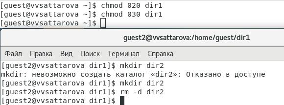{ #fig:018 width=100% }

: Минимальные права для совершения операций от имени пользователей входящих в группу {#tbl:002}

|        Операция        | Минимальные права на директорию | Минимальные права на файл |
|------------------------|---------------------------------|---------------------------|
|     Создание файла     |            d-wx (030)           |         --- (000)         |
|     Удаление файла     |            d-wx (030)           |         --- (000)         |
|      Чтение файла      |            d--x (010)           |         r-- (040)         |
|      Запись в файл     |            d--x (010)           |         -w- (020)         |
|  Переименование файла  |            d-wx (030)           |         --- (000)         | 
| Создание поддиректории |            d-wx (030)           |         --- (000)         |
| Удаление поддиректории |            d-wx (030)           |         --- (000)         |

# Анализ результатов

Полученные таблицы помогают лучше понять, при каких атрибутах какие действия можно выполнять пользователям из одной группы.

# Заключение и выводы

Таким образом, в ходе выполнения лабораторной работы было сделано следующее: 

- Созданы два пользователя в одной группе, вспомнены теоретические основы работы с пользователями в Linux.
- Вспомнены теоретические основы атрибутов файлов и директорий в ОС Linux;
- Созданы две таблицы: "Установленные права и разрешённые действия дл групп" и "Минимальные права для совершения операций от имени пользователей входящих в группу".
- Был проведён анализ, за что отвечают разные атрибуты доступа.  
- Написан отчёт с ответами на вопросы, заданные в пунктах для выполнения в методических рекомендациях к лабораторной работе.

# Список литературы

[@course:infosec_lab3](bib/cite.bib)

[@groups](bib/cite.bib)

[@permissions](bib/cite.bib)