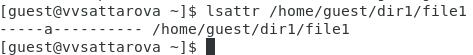

---
## Front matter
lang: ru-RU
title: "Отчёт по лабораторной работе №4 по предмету Информационная безопасность"
subtitle: "Дискреционное разграничение прав в Linux. Расширенные атрибуты"
author: "Саттарова Вита Викторовна"
teacher: "Кулябов Дмитрий Сергеевич"

## Generic otions
lang: ru-RU
toc-title: "Содержание"

## Bibliography
bibliography: bib/cite.bib
csl: pandoc/csl/gost-r-7-0-5-2008-numeric.csl

## Pdf output format
toc: true # Table of contents
toc-depth: 2
lof: true # List of figures
lot: true # List of tables
fontsize: 12pt
linestretch: 1.5
papersize: a4
documentclass: scrreprt
## I18n polyglossia
polyglossia-lang:
  name: russian
  options:
	- spelling=modern
	- babelshorthands=true
polyglossia-otherlangs:
  name: english
## I18n babel
babel-lang: russian
babel-otherlangs: english
## Fonts
mainfont: PT Serif
romanfont: PT Serif
sansfont: PT Sans
monofont: PT Mono
mainfontoptions: Ligatures=TeX
romanfontoptions: Ligatures=TeX
sansfontoptions: Ligatures=TeX,Scale=MatchLowercase
monofontoptions: Scale=MatchLowercase,Scale=0.9
## Biblatex
biblatex: true
biblio-style: "gost-numeric"
biblatexoptions:
  - parentracker=true
  - backend=biber
  - hyperref=auto
  - language=auto
  - autolang=other*
  - citestyle=gost-numeric
## Pandoc-crossref LaTeX customization
figureTitle: "Рис."
tableTitle: "Таблица"
listingTitle: "Листинг"
lofTitle: "Список иллюстраций"
lotTitle: "Список таблиц"
lolTitle: "Листинги"
## Misc options
indent: true
header-includes:
  - \usepackage{indentfirst}
  - \usepackage{float} # keep figures where there are in the text
  - \floatplacement{figure}{H} # keep figures where there are in the text
---

# Цели и задачи работы

**Цели:**

- Получить практические навыки работы в консоли с расширенными атрибутами файлов.
- Закрепить теоретические основы дискреционного разграничения доступа в современных системах с открытым кодом на базе ОС Linux.

**Задачи:**

- Выполнить все пункты, указанные в методических рекомендациях к лабораторной работе.
- Исследовать возможность выполнения действий при расширенном атрибуте -a.
- Исследовать возможность выполнения действий при расширенном атрибуте -i.
- Написать отчёт, проанализировав результаты, полученные в ходе выполнения лабораторной работы.

# Объект и предмет исследования

**Объект исследования:** использование расширенных атрибутов в ОС Linux для обеспечения безопасности.

**Предмет исследования:** расширенные атрибуты, атрибут -a, атрибут -i.

# Условные обозначения и термины

**Условные обозначения**

- ОС - операционная система

**Термины**

- Дискреционное разграничение доступа
- Расширенные атрибуты доступа

# Задание

1. От имени пользователя guest определите расширенные атрибуты файла */home/guest/dir1/file1* командой `lsattr /home/guest/dir1/file1`.

2. Установите командой `chmod 600 file1` на файл file1 права, разрешающие чтение и запись для владельца файла.

3. Попробуйте установить на файл */home/guest/dir1/file1* расширенный атрибут a от имени пользователя guest: `chattr +a /home/guest/dir1/file1`. В ответ вы должны получить отказ от выполнения операции.

4. Зайдите на третью консоль с правами администратора либо повысьте свои права с помощью команды `su`. Попробуйте установить расширенный атрибут a на файл */home/guest/dir1/file1* от имени суперпользователя: `chattr +a /home/guest/dir1/file1`.

5. От пользователя guest проверьте правильность установления атрибута: `lsattr /home/guest/dir1/file1`.

6. Выполните дозапись в файл file1 слова «test» командой `echo "test" /home/guest/dir1/file1`. После этого выполните чтение файла file1 командой `cat /home/guest/dir1/file1`. Убедитесь, что слово test было успешно записано в file1.

7. Попробуйте удалить файл file1 либо стереть имеющуюся в нём информацию командой `echo "abcd" > /home/guest/dirl/file1`. Попробуйте переименовать файл.

8. Попробуйте с помощью команды `chmod 000 file1` установить на файл file1 права, например, запрещающие чтение и запись для владельца файла. Удалось ли вам успешно выполнить указанные команды?

9. Снимите расширенный атрибут a с файла */home/guest/dirl/file1* от имени суперпользователя командой `chattr -a /home/guest/dir1/file1`. Повторите операции, которые вам ранее не удавалось выполнить. Ваши наблюдения занесите в отчёт.

10. Повторите ваши действия по шагам, заменив атрибут «a» атрибутом «i». Удалось ли вам дозаписать информацию в файл? Ваши наблюдения занесите в отчёт.

Более подробно о работе см. в [@course:infosec_lab4](bib/cite.bib).

# Теоретическое введение

## Основы работы с расширенными атрибутами доступа в ОС Linux

Один из методов защиты файлов на сервере Linux — работа с атрибутами. Атрибуты выполняют свою работу независимо от пользователя, который обращается к файлу.

Если вы хотите применить атрибуты, вы можете использовать команду `chattr`. Например, используйте `chattr +s somefile`, чтобы применить атрибуты к somefile. Для удаления атрибута используйте `chattr -s somefile`. Чтобы получить обзор всех атрибутов, которые в настоящее время применяются, используйте команду `lsattr`.

**Ниже приведены наиболее полезные атрибуты, которые вы можете применить.**

*-A* Этот атрибут гарантирует, что время доступа к файлу файла не изменяется. Обычно каждый раз, когда файл открывается, время доступа к файлу должно быть записано в метаданные файла. Это отрицательно влияет на производительность; поэтому для файлов, к которым осуществляется регулярный доступ, атрибут A можно использовать для отключения этой функции.

*-a* Этот атрибут позволяет добавлять, но не удалять файл.

*-c* Если вы используете файловую систему, в которой поддерживается сжатие на уровне тома, этот атрибут файла гарантирует, что файл будет сжат при первом включении механизма сжатия.

*-D* Этот атрибут гарантирует, что изменения в файлах записываются на диск немедленно, а не в кэширование в первую очередь. Это полезный атрибут в важных файлах базы данных, позволяющий убедиться, что они не теряются между файловым кешем и жестким диском.

*-d* Этот атрибут гарантирует, что файл не будет сохранен в резервных копиях, где используется утилита дампа.

*-I* Этот атрибут включает индексирование для каталога, в котором он включен. Это обеспечивает более быстрый доступ к файлам для примитивных файловых систем, таких как Ext3, которые не используют базу данных B-tree для быстрого доступа к файлам.

*-i* Этот атрибут делает файл неизменным. Следовательно, в файл нельзя вносить изменения, что полезно для файлов, которые нуждаются в дополнительной защите.

*-j* Этот атрибут гарантирует, что в файловой системе ext3 файл сначала записывается в журнал, а затем — в блоки данных на жестком диске.

*-s* Перезаписать блоки, в которых файл был сохранен, на 0 с после удаления файла. Это гарантирует, что восстановление файла невозможно после того, как он был удален.

*-u* Этот атрибут сохраняет информацию об удалении. Это позволяет разрабатывать утилиту, которая работает с этой информацией для спасения удаленных файлов.

Более подробно о работе см. в [@atributes](bib/cite.bib).

# Техническое оснащение и выбранные методы проведения работы

**Техническое оснащение**

- Ноутбук
- CentOS
- Интернет

**Методы проведения работы**

- Изучение методической информации
- Выполнение заданий в соответствии с указаниями
- Анализ результатов
- Обобщение полученных результатов в табличном виде
- Обобщение проведённой деятельности

# Выполнение лабораторной работы и полученные результаты

1. Скачала и ознакомилась с методическими указаниями к лабораторной работе (рис. @fig:001).

{ #fig:001 width=100% }

2. От имени пользователя guest определила расширенные атрибуты файла */home/guest/dir1/file1* командой `lsattr /home/guest/dir1/file1` (рис. @fig:002). 

{ #fig:002 width=100% }

3. Установила командой `chmod 600 file1` на файл file1 права, разрешающие чтение и запись для владельца файла (рис. @fig:003).

{ #fig:003 width=100% }

4. Попробовала установить на файл */home/guest/dir1/file1* расширенный атрибут a от имени пользователя guest: `chattr +a /home/guest/dir1/file1`. В ответ получила отказ от выполнения операции (рис. @fig:004).

{ #fig:004 width=100% }

5. Зашла на другую консоль с правами администратора с помощью команды `su -`. Попробовала установить расширенный атрибут a на файл */home/guest/dir1/file1* от имени суперпользователя: `chattr +a /home/guest/dir1/file1` (рис. @fig:005).

{ #fig:005 width=100% }

6. От пользователя guest проверила правильность установления атрибута: `lsattr /home/guest/dir1/file1` (рис. @fig:006).

{ #fig:006 width=100% }

7. Выполнила дозапись в файл file1 слова «test» командой `echo "test" >> /home/guest/dir1/file1`. После этого выполнила чтение файла file1 командой `cat /home/guest/dir1/file1`. Убедилась, что слово test было успешно записано в file1 (рис. @fig:007).

{ #fig:007 width=100% }

8. Попробовала удалить файл file1 и стереть имеющуюся в нём информацию командой `echo "abcd" > /home/guest/dirl/file1`. Попробовала переименовать файл (рис. @fig:008).

{ #fig:008 width=100% }

9. Попробовала с помощью команды `chmod 000 file1` установить на файл file1 права, например, запрещающие чтение и запись для владельца файла. Мне не удалось успешно выполнить указанные команды (рис. @fig:009).

{ #fig:009 width=100% }

10. Сняла расширенный атрибут a с файла */home/guest/dirl/file1* от имени суперпользователя командой `chattr -a /home/guest/dir1/file1`. Повторила операции, которые мне ранее не удавалось выполнить. Все операции, которые ранее не удалось выполнить, мне теперь выполнить удалось (рис. @fig:010).

{ #fig:010 width=100% }

11. Повторила действия по шагам, заменив атрибут «a» атрибутом «i». Мне не удалось дозаписать информацию в файл. Также мне не удалось выполнить и другие команды кроме чтения файла (рис. @fig:011).

{ #fig:011 width=100% }

# Анализ результатов

Таким образом, мне не удавалось выполнять большинство действий с файлом при наличии расширенных атрибутов, которые я могла выполнять, когда никаких расширенных атрибутов не было.

Полученная информация помогает лучше понять, при каких расширенных атрибутах какие действия можно выполнять и как расширенные атрибуты влияют на работу пользователей с файлами.

# Заключение и выводы

Таким образом, в ходе выполнения лабораторной работы было сделано следующее: 

- Вспомнены теоретические основы атрибутов файлов и директорий в ОС Linux.
- Был проведён анализ, за что отвечают разные расширенные атрибуты доступа и как они влияют на возможность выполнения действий пользователем.  
- Написан отчёт к лабораторной работе.

# Список литературы

[@course:infosec_lab4](bib/cite.bib)

[@atributes](bib/cite.bib)