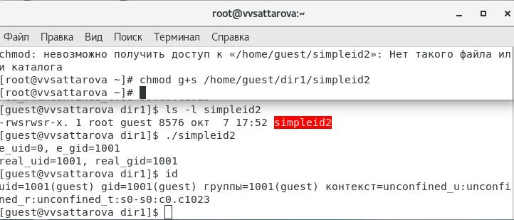
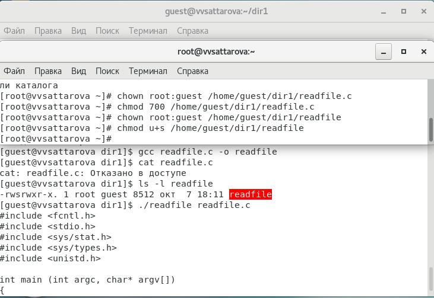

---
## Front matter
lang: ru-RU
title: Презентация к лабораторной работе 5
subtitle: Дискреционное разграничение прав в Linux. Исследование влияния дополнительных атрибутов
author:
  - Саттарова В.В.
institute:
  - Российский университет дружбы народов, Москва, Россия
date: 7 октября 2023

## i18n babel
babel-lang: russian
babel-otherlangs: english

## Formatting pdf
toc: false
toc-title: Содержание
slide_level: 2
aspectratio: 169
section-titles: true
theme: metropolis
mainfont: PT Serif
romanfont: PT Serif
sansfont: PT Sans
monofont: PT Mono
header-includes:
 - \metroset{progressbar=frametitle,sectionpage=progressbar,numbering=fraction}
 - '\makeatletter'
 - '\beamer@ignorenonframefalse'
 - '\makeatother'
---

# Информация

## Докладчик

:::::::::::::: {.columns align=center}
::: {.column width="70%"}

  * Саттарова Вита Викторовна
  * студент НФИбд-02-20, 1032201655
  * Российский университет дружбы народов

:::
::::::::::::::

# Вводная часть

## Актуальность и прагматика

- Практические навыки работы в консоли с SetUID- и Sticky-битами файлов помогут при выполнении дальнейших работ и научат настраивать особый доступ пользователям к файлам
- Дискреционное разграничения доступа в современных системах помогает обеспечить безопасность системы при работе большого числа пользоваетлей

## Цели 

- Закрепить теоретические основы дискреционного разграничения доступа в современных системах с открытым кодом на базе ОС Linux.
- Изучить механизмы изменения идентификаторов, применения SetUID- и Sticky-битов. 
- Получить практические навыки работы в консоли с дополнительными атрибутами. 
- Рассмотреть работу механизма смены идентификатора процессов пользователей, а также влияние бита Sticky на запись и удаление файлов.

## Задачи

- Выполнить все пункты, указанные в методических рекомендациях к лабораторной работе.
- Ответить на вопросы, заданные в методических рекомендациях к лабораторной работе.
- Выполняя задания, изучить особенности SetUID-.
- Выполняя задания, изучить особенности Sticky-битов.
- Написать отчёт, проанализировав результаты, полученные в ходе выполнения лабораторной работы.

## Работа с SetUID-битом

## Работа с Sticky-битом

# Результаты

- Вспомнены теоретические основы атрибутов файлов и директорий в ОС Linux.
- Изучены механизмы изменения идентификаторов, применения SetUID- и Sticky-битов. 
- Получены практические навыки работы в консоли с дополнительными атрибутами. 
- Рассмотрена работа механизма смены идентификатора процессов пользователей, а также влияние бита Sticky на запись и удаление файлов.
- Написан отчёт к лабораторной работе.