---
## Front matter
lang: ru-RU
title: "Отчёт по лабораторной работе №5 по предмету Информационная безопасность"
subtitle: "Дискреционное разграничение прав в Linux. Исследование влияния дополнительных атрибутов"
author: "Саттарова Вита Викторовна"
teacher: "Кулябов Дмитрий Сергеевич"

## Generic otions
lang: ru-RU
toc-title: "Содержание"

## Bibliography
bibliography: bib/cite.bib
csl: pandoc/csl/gost-r-7-0-5-2008-numeric.csl

## Pdf output format
toc: true # Table of contents
toc-depth: 2
lof: true # List of figures
lot: true # List of tables
fontsize: 12pt
linestretch: 1.5
papersize: a4
documentclass: scrreprt
## I18n polyglossia
polyglossia-lang:
  name: russian
  options:
	- spelling=modern
	- babelshorthands=true
polyglossia-otherlangs:
  name: english
## I18n babel
babel-lang: russian
babel-otherlangs: english
## Fonts
mainfont: PT Serif
romanfont: PT Serif
sansfont: PT Sans
monofont: PT Mono
mainfontoptions: Ligatures=TeX
romanfontoptions: Ligatures=TeX
sansfontoptions: Ligatures=TeX,Scale=MatchLowercase
monofontoptions: Scale=MatchLowercase,Scale=0.9
## Biblatex
biblatex: true
biblio-style: "gost-numeric"
biblatexoptions:
  - parentracker=true
  - backend=biber
  - hyperref=auto
  - language=auto
  - autolang=other*
  - citestyle=gost-numeric
## Pandoc-crossref LaTeX customization
figureTitle: "Рис."
tableTitle: "Таблица"
listingTitle: "Листинг"
lofTitle: "Список иллюстраций"
lotTitle: "Список таблиц"
lolTitle: "Листинги"
## Misc options
indent: true
header-includes:
  - \usepackage{indentfirst}
  - \usepackage{float} # keep figures where there are in the text
  - \floatplacement{figure}{H} # keep figures where there are in the text
---

# Цели и задачи работы

**Цели:**

- Закрепить теоретические основы дискреционного разграничения доступа в современных системах с открытым кодом на базе ОС Linux.
- Изучить механизмы изменения идентификаторов, применения SetUID- и Sticky-битов. 
- Получить практические навыки работы в консоли с дополнительными атрибутами. 
- Рассмотреть работу механизма смены идентификатора процессов пользователей, а также влияние бита Sticky на запись и удаление файлов.

**Задачи:**

- Выполнить все пункты, указанные в методических рекомендациях к лабораторной работе.
- Ответить на вопросы, заданные в методических рекомендациях к лабораторной работе.
- Выполняя задания, изучить особенности SetUID-.
- Выполняя задания, изучить особенности Sticky-битов.
- Написать отчёт, проанализировав результаты, полученные в ходе выполнения лабораторной работы.

# Объект и предмет исследования

**Объект исследования:** использование SetUID- и Sticky-битов в ОС Linux для обеспечения безопасности.

**Предмет исследования:** идентификаторы, SetUID-, Sticky-бит.

# Условные обозначения и термины

**Условные обозначения**

- ОС - операционная система

**Термины**

- Дискреционное разграничение доступа
- идентификаторы
- SetUID-
- Sticky-бит


# Задание

## Создание программы

1. Войдите в систему от имени пользователя guest.

2. Создайте программу simpleid.c:

```
#include <sys/types.h>
#include <unistd.h>
#include <stdio.h>
int
main ()
{
uid_t uid = geteuid ();
gid_t gid = getegid ();
printf ("uid=%d, gid=%d\n", uid, gid);
return 0;
}
```

3. Скомплилируйте программу и убедитесь, что файл программы создан:

`gcc simpleid.c -o simpleid`

4. Выполните программу simpleid:

`./simpleid`

5. Выполните системную программу id:

`id`

и сравните полученный вами результат с данными предыдущего пункта задания.

6. Усложните программу, добавив вывод действительных идентификаторов:

```
#include <sys/types.h>
#include <unistd.h>
#include <stdio.h>
int
main ()
{
uid_t real_uid = getuid ();
uid_t e_uid = geteuid ();
gid_t real_gid = getgid ();
gid_t e_gid = getegid () ;
printf ("e_uid=%d, e_gid=%d\n", e_uid, e_gid);
printf ("real_uid=%d, real_gid=%d\n", real_uid,
,→ real_gid);
return 0;
}
Получившуюся программу назовите simpleid2.c.
```

7. Скомпилируйте и запустите simpleid2.c:

`gcc simpleid2.c -o simpleid2`

`./simpleid2`

8. От имени суперпользователя выполните команды:

`chown root:guest /home/guest/simpleid2`

`chmod u+s /home/guest/simpleid2`

9. Используйте sudo или повысьте временно свои права с помощью su. Поясните, что делают эти команды.

10. Выполните проверку правильности установки новых атрибутов и смены владельца файла simpleid2:

`ls -l simpleid2`

11. Запустите simpleid2 и id:

`./simpleid2`

`id`

Сравните результаты.

12. Проделайте тоже самое относительно SetGID-бита.

13. Создайте программу readfile.c:

```
#include <fcntl.h>
#include <stdio.h>
#include <sys/stat.h>
#include <sys/types.h>
#include <unistd.h>
int
main (int argc, char* argv[])
{
unsigned char buffer[16];
size_t bytes_read;
int i;
int fd = open (argv[1], O_RDONLY);
do
{
bytes_read = read (fd, buffer, sizeof (buffer));
for (i =0; i < bytes_read; ++i) printf("%c", buffer[i]);
}
while (bytes_read == sizeof (buffer));
close (fd);
return 0;
}
```

14. Откомпилируйте её.

`gcc readfile.c -o readfile`

15. Смените владельца у файла readfile.c (или любого другого текстового файла в системе) и измените права так, чтобы только суперпользователь
(root) мог прочитать его, a guest не мог.

16. Проверьте, что пользователь guest не может прочитать файл readfile.c.

17. Смените у программы readfile владельца и установите SetU’D-бит.

18. Проверьте, может ли программа readfile прочитать файл readfile.c?

19. Проверьте, может ли программа readfile прочитать файл /etc/shadow?

Отразите полученный результат и ваши объяснения в отчёте. 

## Исследование Sticky-бита

1. Выясните, установлен ли атрибут Sticky на директории /tmp, для чего выполните команду

`ls -l / | grep tmp`

2. От имени пользователя guest создайте файл file01.txt в директории /tmp со словом test:

`echo "test" > /tmp/file01.txt`

3. Просмотрите атрибуты у только что созданного файла и разрешите чтение и запись для категории пользователей «все остальные»:

```
ls -l /tmp/file01.txt
chmod o+rw /tmp/file01.txt
ls -l /tmp/file01.txt
```

4. От пользователя guest2 (не являющегося владельцем) попробуйте прочитать файл /tmp/file01.txt:

`cat /tmp/file01.txt`

5. От пользователя guest2 попробуйте дозаписать в файл

```
/tmp/file01.txt слово test2 командой
echo "test2" > /tmp/file01.txt
```

Удалось ли вам выполнить операцию?

6. Проверьте содержимое файла командой

`cat /tmp/file01.txt`

7. От пользователя guest2 попробуйте записать в файл /tmp/file01.txt слово test3, стерев при этом всю имеющуюся в файле информацию командой

`echo "test3" > /tmp/file01.txt`

Удалось ли вам выполнить операцию?

8. Проверьте содержимое файла командой

`cat /tmp/file01.txt`

9. От пользователя guest2 попробуйте удалить файл /tmp/file01.txt командой

`rm /tmp/fileOl.txt`

Удалось ли вам удалить файл?

10. Повысьте свои права до суперпользователя следующей командой

`su -`

и выполните после этого команду, снимающую атрибут t (Sticky-бит) с директории /tmp:

`chmod -t /tmp`

11. Покиньте режим суперпользователя командой

`exit`

12. От пользователя guest2 проверьте, что атрибута t у директории /tmp нет:

`ls -l / | grep tmp`

13. Повторите предыдущие шаги. Какие наблюдаются изменения?

14. Удалось ли вам удалить файл от имени пользователя, не являющегося его владельцем? Ваши наблюдения занесите в отчёт.

15. Повысьте свои права до суперпользователя и верните атрибут t на директорию /tmp:

```
su -
chmod +t /tmp
exit
```

Более подробно о работе см. в [@course:infosec_lab5](bib/cite.bib).

# Теоретическое введение

## Подготовка лабораторного стенда

Помимо прав администратора для выполнения части заданий потребуются средства разработки приложений. В частности, при подготовке стенда следует убедиться, что в системе установлен компилятор gcc (для этого, например, можно ввести команду gcc -v). Если же gcc не установлен, то его необходимо установить, например, командой `yum install gcc`, которая определит зависимости и установит следующие пакеты: gcc, cloogppl, срр, glibc-devel, glibc-headers, kernel-headers, libgomp, ppl, cloog-ppl, срр, gcc, glibc-devel, glibc-headers, kernel-headers, libgomp, libstdc++-devel, mpfr, ppl, glibc, glibc-common, libgcc, libstdc++.

Файловая система, где располагаются домашние директории и файлы пользователей (в частности, пользователя guest), не должна быть смонтирована с опцией nosuid.

Так как программы с установленным битом SetUID могут представлять большую брешь в системе безопасности, в современных системах используются дополнительные механизмы защиты. Проследите, чтобы система защиты SELinux не мешала выполнению заданий работы. Если вы не знаете, что это такое, просто отключите систему запретов до очередной перезагрузки системы командой `setenforce 0` После этого команда getenforce должна выводить Permissive. 

## Компилирование программ

Для выполнения четвёртой части задания вам потребуются навыки программирования, а именно, умение компилировать простые программы, написанные на языке С (С++),  используя интерфейс CLI.

Само по себе создание программ не относится к теме, по которой выполняется работа, а является вспомогательной частью, позволяющей увидеть, как реализуются на практике те или иные механизмы дискреционного разграничения доступа. Если при написании (или исправлении существующих) скриптов на bash-e у большинства системных администраторов не возникает проблем, то процесс компилирования, как показывает практика, вызывает необоснованные затруднения.

Компиляторы, доступные в Linux-системах, являются частью коллекции GNU-компиляторов, известной как GCC (GNU Compiller Collection, подробнее см. http://gcc.gnu.org). В неё входят компиляторы языков С, С++, Java, Objective-C, Fortran и Chill. Будем использовать лишь первые два.

Компилятор языка С называется gcc. Компилятор языка С++ называется g++ и запускается с параметрами почти так же, как gcc. Проверить это можно следующими командами: `whereis gcc`, `whereis g++`

Первый шаг заключается в превращении исходных файлов в объектный код:

`gcc -c file.с`

В случае успешного выполнения команды (отсутствие ошибок в коде) полученный объектный файл будет называться file.о.

Объектные файлы невозможно запускать и использовать, поэтому после компиляции для получения готовой программы объектные файлы необходимо скомпоновать.Компоновать можно один или несколько файлов. В случае использования хотя бы одного из файлов, написанных на С++, компоновка производится с помощью компилятора g++. Строго говоря, это тоже не вполне верно. Компоновка объектного кода, сгенерированного чем бы то ни было (хоть вручную), производится линкером ld, g++ его просто вызывает изнутри. Если же все файлы написаны на языке С, нужно использовать компилятор gcc.

Например, так: `gcc -o program file.o` В случае успешного выполнения команды будет создана программа program (исполняемый файл формата ELF с установленным атрибутом +х).

Компилирование — это процесс. Компилятор gcc (g++) имеет множество параметров, влияющих на процесс компиляции. Он поддерживает различные режимы оптимизации, выбор платформы назначения и пр. Также возможно использование make-файлов (Makefile) с помощью утилиты make для упрощения процесса компиляции.

Такое решение подойдёт лишь для простых случаев. Если говорить про пример выше, то компилирование одного файла из двух шагов можно сократить вообще до одного, например: `gcc file.c`

В этом случае готовая программа будет иметь называние a.out. Механизм компилирования программ в данной работе не мог быть не рассмотрен потому, что использование программ, написанных на bash, для изучения SetUID- и SetGID- битов, не представляется возможным. Связано это с тем, что любая bash-программа интерпретируется в процессе своего выполнения, т.е. существует сторонняя программа-интерпретатор, которая выполняет считывание файла сценария и выполняет его последовательно. Сам интерпретатор выполняется с правами пользователя, его запустившего, а значит, и выполняемая программа использует эти права. При этом интерпретатору абсолютно всё равно, установлены SetUID-, SetGID-биты у текстового файла сценария, атрибут разрешения запуска «x» или нет. Важно, чтобы был установлен лишь атрибут, разрешающий чтение «r».

Также не важно, был ли вызван интерпретатор из командной строки (запуск файла, как bash file1.sh), либо внутри файла была указана строчка `#!/bin/bash`.

Логично спросить: если установление SetUID- и SetGID- битов на сценарий не приводит к нужному результату как с исполняемыми файлами, то что мешает установить эти биты на сам интерпретатор? Ничего не мешает, только их установление приведёт к тому, что, так как владельцем /bin/bash является root: `ls -l /bin/bash` все сценарии, выполняемые с использованием /bin/bash, будут иметь возможности суперпользователя — совсем не тот результат, который хотелось бы видеть.

Если сомневаетесь в выше сказанном, создайте простой файл progl.sh следующего содержания: 

```
#!/bin/bash 
/usr/bin/id /usr/bin/whoami
```

и попробуйте поменять его атрибуты в различных конфигурациях. Подход вида: сделать копию /bin/bash, для нее chown user:users и потом SUID также плох, потому что это позволит запускать любые команды от пользователя user.

Более подробно о работе см. в [@course:infosec_lab5](bib/cite.bib).

# Техническое оснащение и выбранные методы проведения работы

**Техническое оснащение**

- Ноутбук
- CentOS
- Интернет

**Методы проведения работы**

- Изучение методической информации
- Выполнение заданий в соответствии с указаниями
- Анализ результатов
- Оветы на вопросы, заданные в задании
- Обобщение проведённой деятельности

# Выполнение лабораторной работы и полученные результаты

1. Скачала и ознакомилась с методическими указаниями к лабораторной работе (рис. @fig:001).

{ #fig:001 width=100% }

2. Выполнила следующие задания: 

- Войдите в систему от имени пользователя guest.

- Создайте программу simpleid.c:

```
#include <sys/types.h>
#include <unistd.h>
#include <stdio.h>
int
main ()
{
uid_t uid = geteuid ();
gid_t gid = getegid ();
printf ("uid=%d, gid=%d\n", uid, gid);
return 0;
}
```

(рис. @fig:002). 

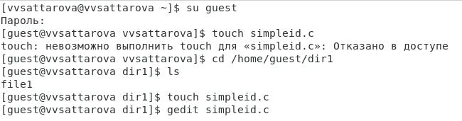{ #fig:002 width=100% }

3. Выполнила следующие задания:

- Скомплилируйте программу и убедитесь, что файл программы создан: `gcc simpleid.c -o simpleid`

- Выполните программу simpleid:
`./simpleid`

- Выполните системную программу id:
`id`

и сравните полученный вами результат с данными предыдущего пункта задания - вывод одинаковый (рис. @fig:003).

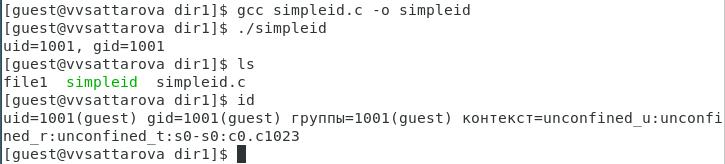{ #fig:003 width=100% }

4. Код первой программы (рис. @fig:004).

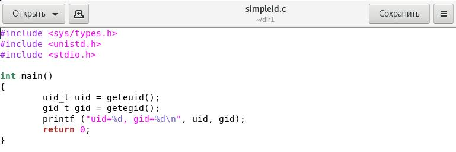{ #fig:004 width=100% }

5. Код второй программы (рис. @fig:005).

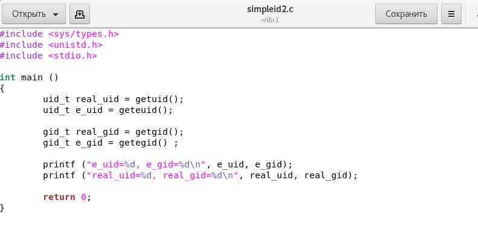{ #fig:005 width=100% }

6. Выполнила следующие задания:

- Усложните программу, добавив вывод действительных идентификаторов:

```
#include <sys/types.h>
#include <unistd.h>
#include <stdio.h>
int
main ()
{
uid_t real_uid = getuid ();
uid_t e_uid = geteuid ();
gid_t real_gid = getgid ();
gid_t e_gid = getegid () ;
printf ("e_uid=%d, e_gid=%d\n", e_uid, e_gid);
printf ("real_uid=%d, real_gid=%d\n", real_uid,
,→ real_gid);
return 0;
}
```
Получившуюся программу назовите simpleid2.c.

- Скомпилируйте и запустите simpleid2.c:

`gcc simpleid2.c -o simpleid2`

`./simpleid2`

(рис. @fig:006).

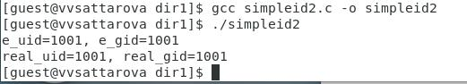{ #fig:006 width=100% }

7. Выполнила следующие задания:

- От имени суперпользователя выполните команды:

`chown root:guest /home/guest/simpleid2`

`chmod u+s /home/guest/simpleid2`

- Используйте sudo или повысьте временно свои права с помощью su. Поясните, что делают эти команды - первая меняет владельца файла, вторая меняет SetUID-бит. (рис. @fig:007).

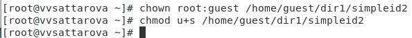{ #fig:007 width=100% }

8. Выполнила следующие задания:

- Выполните проверку правильности установки новых атрибутов и смены владельца файла simpleid2:

`ls -l simpleid2`

- Запустите simpleid2 и id:

`./simpleid2`

`id`

Сравните результаты - отличается e_uid  и UID (рис. @fig:008).

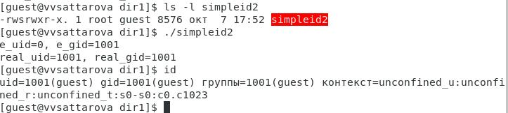{ #fig:008 width=100% }

9. Выполнила следующие задания:

- Проделайте тоже самое относительно SetGID-бита - результаты не изменились (рис. @fig:009).

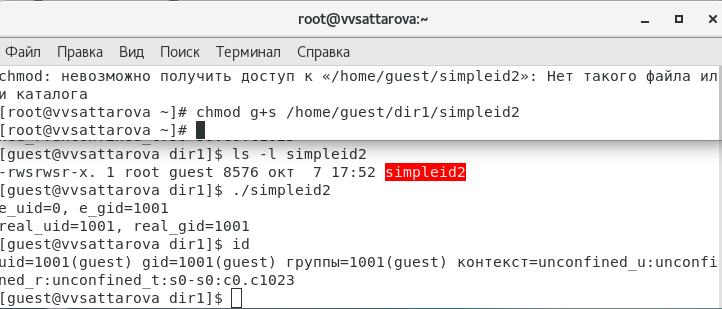{ #fig:009 width=100% }

10. Выполнила следующие задания:

- Создайте программу readfile.c:

```
#include <fcntl.h>
#include <stdio.h>
#include <sys/stat.h>
#include <sys/types.h>
#include <unistd.h>
int
main (int argc, char* argv[])
{
unsigned char buffer[16];
size_t bytes_read;
int i;
int fd = open (argv[1], O_RDONLY);
do
{
bytes_read = read (fd, buffer, sizeof (buffer));
for (i =0; i < bytes_read; ++i) printf("%c", buffer[i]);
}
while (bytes_read == sizeof (buffer));
close (fd);
return 0;
}
``` 

(рис. @fig:010).

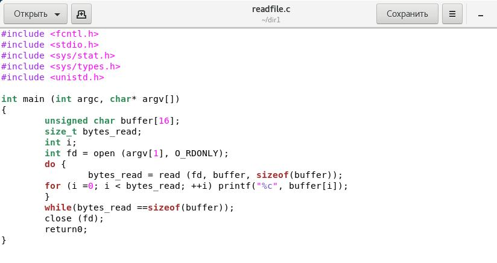{ #fig:010 width=100% }

11. Выполнила следующие задания:

- Откомпилируйте её.

`gcc readfile.c -o readfile`

- Смените владельца у файла readfile.c (или любого другого текстового файла в системе) и измените права так, чтобы только суперпользователь
(root) мог прочитать его, a guest не мог.

- Проверьте, что пользователь guest не может прочитать файл readfile.c.

- Смените у программы readfile владельца и установите SetU’D-бит.

- Проверьте, может ли программа readfile прочитать файл readfile.c? Да, может. 

(рис. @fig:011).

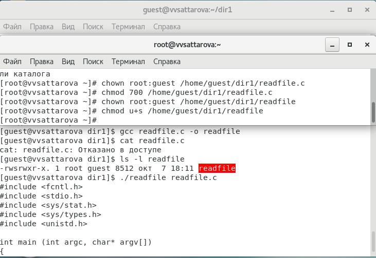{ #fig:011 width=100% }

12. Выполнила следующие задания:

- Проверьте, может ли программа readfile прочитать файл /etc/shadow? Да, может (рис. @fig:012).

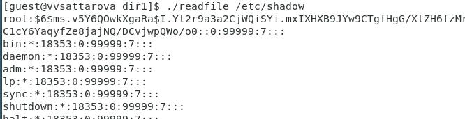{ #fig:012 width=100% }

13. Выполнила следующие задания:

- Выясните, установлен ли атрибут Sticky на директории /tmp, для чего выполните команду

`ls -l / | grep tmp`

- От имени пользователя guest создайте файл file01.txt в директории /tmp со словом test:

`echo "test" > /tmp/file01.txt`

- Просмотрите атрибуты у только что созданного файла и разрешите чтение и запись для категории пользователей «все остальные»:

```
ls -l /tmp/file01.txt
chmod o+rw /tmp/file01.txt
ls -l /tmp/file01.txt
```

(рис. @fig:013).

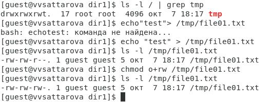{ #fig:013 width=100% }

14. Выполнила следующие задания:

- От пользователя guest2 (не являющегося владельцем) попробуйте прочитать файл /tmp/file01.txt:

`cat /tmp/file01.txt`

- От пользователя guest2 попробуйте дозаписать в файл

```
/tmp/file01.txt слово test2 командой
echo "test2" > /tmp/file01.txt
```

Удалось ли вам выполнить операцию? Да.

- Проверьте содержимое файла командой

`cat /tmp/file01.txt`

- От пользователя guest2 попробуйте записать в файл /tmp/file01.txt слово test3, стерев при этом всю имеющуюся в файле информацию командой

`echo "test3" > /tmp/file01.txt`

Удалось ли вам выполнить операцию? Да.

- Проверьте содержимое файла командой

`cat /tmp/file01.txt`

- От пользователя guest2 попробуйте удалить файл /tmp/file01.txt командой

`rm /tmp/fileOl.txt`

Удалось ли вам удалить файл? Нет.

(рис. @fig:014).

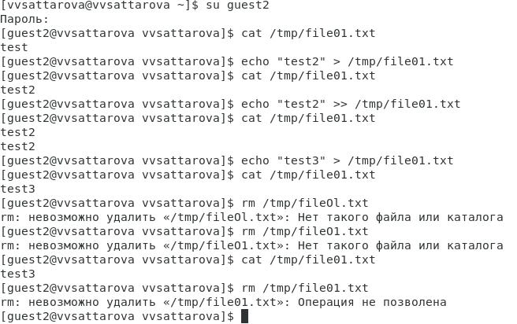{ #fig:014 width=100% }

15. Выполнила следующие задания:

- Повысьте свои права до суперпользователя следующей командой

`su -`

и выполните после этого команду, снимающую атрибут t (Sticky-бит) с директории /tmp:

`chmod -t /tmp`

- Покиньте режим суперпользователя командой

`exit`

- От пользователя guest2 проверьте, что атрибута t у директории /tmp нет:

`ls -l / | grep tmp`

- Повторите предыдущие шаги. Какие наблюдаются изменения? Изменений практически нет, все действия выполняются, включая удаление.

- Удалось ли вам удалить файл от имени пользователя, не являющегося его владельцем? Да, удалось. 

(рис. @fig:015).

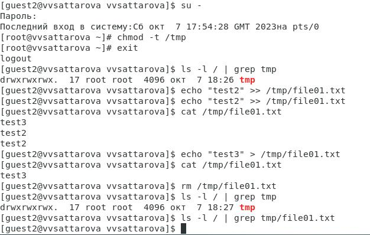{ #fig:015 width=100% }

16. Выполнила следующие задания:

- Повысьте свои права до суперпользователя и верните атрибут t на директорию /tmp:

```
su -
chmod +t /tmp
exit
```

(рис. @fig:016).

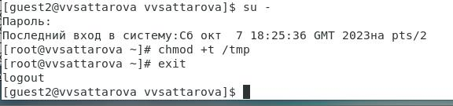{ #fig:016 width=100% }

# Анализ результатов

Таким образом, были выаолнены задания по изучению идентификаторов, SetUID-бита, Sticky-бита.

# Заключение и выводы

Таким образом, в ходе выполнения лабораторной работы было сделано следующее: 

- Вспомнены теоретические основы атрибутов файлов и директорий в ОС Linux.
- Изучены механизмы изменения идентификаторов, применения SetUID- и Sticky-битов. 
- Получены практические навыки работы в консоли с дополнительными атрибутами. 
- Рассмотрена работа механизма смены идентификатора процессов пользователей, а также влияние бита Sticky на запись и удаление файлов.
- Написан отчёт к лабораторной работе.

# Список литературы

[@course:infosec_lab5](bib/cite.bib)