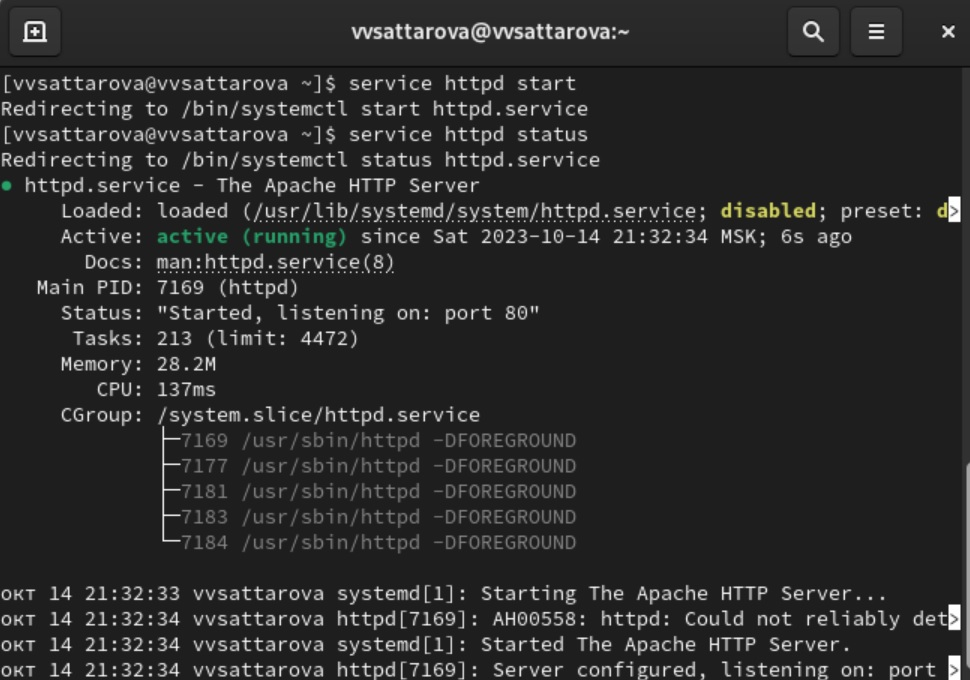

---
## Front matter
lang: ru-RU
title: "Отчёт по лабораторной работе №6 по предмету Информационная безопасность"
subtitle: "Мандатное разграничение прав в Linux"
author: "Саттарова Вита Викторовна"
teacher: "Кулябов Дмитрий Сергеевич"

## Generic otions
lang: ru-RU
toc-title: "Содержание"

## Bibliography
bibliography: bib/cite.bib
csl: pandoc/csl/gost-r-7-0-5-2008-numeric.csl

## Pdf output format
toc: true # Table of contents
toc-depth: 2
lof: true # List of figures
lot: true # List of tables
fontsize: 12pt
linestretch: 1.5
papersize: a4
documentclass: scrreprt
## I18n polyglossia
polyglossia-lang:
  name: russian
  options:
	- spelling=modern
	- babelshorthands=true
polyglossia-otherlangs:
  name: english
## I18n babel
babel-lang: russian
babel-otherlangs: english
## Fonts
mainfont: PT Serif
romanfont: PT Serif
sansfont: PT Sans
monofont: PT Mono
mainfontoptions: Ligatures=TeX
romanfontoptions: Ligatures=TeX
sansfontoptions: Ligatures=TeX,Scale=MatchLowercase
monofontoptions: Scale=MatchLowercase,Scale=0.9
## Biblatex
biblatex: true
biblio-style: "gost-numeric"
biblatexoptions:
  - parentracker=true
  - backend=biber
  - hyperref=auto
  - language=auto
  - autolang=other*
  - citestyle=gost-numeric
## Pandoc-crossref LaTeX customization
figureTitle: "Рис."
tableTitle: "Таблица"
listingTitle: "Листинг"
lofTitle: "Список иллюстраций"
lotTitle: "Список таблиц"
lolTitle: "Листинги"
## Misc options
indent: true
header-includes:
  - \usepackage{indentfirst}
  - \usepackage{float} # keep figures where there are in the text
  - \floatplacement{figure}{H} # keep figures where there are in the text
---

# Цели и задачи работы

**Цели:**

- Развить навыки администрирования ОС Linux. Получить первое практическое знакомство с технологией SELinux.
- Проверить работу SELinx на практике совместно с веб-сервером Apache.

**Задачи:**

- Выполнить все пункты, указанные в методических рекомендациях к лабораторной работе.
- Ответить на вопросы, заданные в методических рекомендациях к лабораторной работе.
- Выполняя задания, познакомиться с технологией SELinux.
- Выполняя задания, поработать с SELinx с веб-сервером Apache.
- Написать отчёт, проанализировав результаты, полученные в ходе выполнения лабораторной работы.

# Объект и предмет исследования

**Объект исследования:** использование SELinux и веб-сервером Apache для обеспечения безопасности.

**Предмет исследования:** администрирование, SELinux, веб-сервер Apache.

# Условные обозначения и термины

**Условные обозначения**

- ОС - операционная система

**Термины**

- контекст безопасности


# Задание

1. Войдите в систему с полученными учётными данными и убедитесь, что SELinux работает в режиме enforcing политики targeted с помощью команд `getenforce` и `sestatus`.

2. Обратитесь с помощью браузера к веб-серверу, запущенному на вашем компьютере, и убедитесь, что последний работает: `service httpd status` или `/etc/rc.d/init.d/httpd status` Если не работает, запустите его так же, но с параметром start.

3. Найдите веб-сервер Apache в списке процессов, определите его контекст безопасности и занесите эту информацию в отчёт. Например, можно использовать команду `ps auxZ | grep httpd` или `ps -eZ | grep httpd`

4. Посмотрите текущее состояние переключателей SELinux для Apache с помощью команды `sestatus -b | grep httpd` Обратите внимание, что многие из них находятся в положении «off».

5. Посмотрите статистику по политике с помощью команды `seinfo`, также определите множество пользователей, ролей, типов.

6. Определите тип файлов и поддиректорий, находящихся в директории /var/www, с помощью команды `ls -lZ /var/www`

7. Определите тип файлов, находящихся в директории /var/www/html: `ls -lZ /var/www/html`

8. Определите круг пользователей, которым разрешено создание файлов в директории /var/www/html.

9. Создайте от имени суперпользователя (так как в дистрибутиве после установки только ему разрешена запись в директорию) html-файл /var/www/html/test.html следующего содержания:

```
<html>
<body>test</body>
</html>
```

10. Проверьте контекст созданного вами файла. Занесите в отчёт контекст, присваиваемый по умолчанию вновь созданным файлам в директории /var/www/html.

11. Обратитесь к файлу через веб-сервер, введя в браузере адрес http://127.0.0.1/test.html. Убедитесь, что файл был успешно отображён.

12. Изучите справку man httpd_selinux и выясните, какие контексты файлов определены для httpd. Сопоставьте их с типом файла test.html. Проверить контекст файла можно командой ls -Z. `ls -Z /var/www/html/test.html`

13. Измените контекст файла /var/www/html/test.html с httpd_sys_content_t на любой другой, к которому процесс httpd не должен иметь доступа, например, на samba_share_t: `chcon -t samba_share_t /var/www/html/test.html` `ls -Z /var/www/html/test.html` После этого проверьте, что контекст поменялся.

14. Попробуйте ещё раз получить доступ к файлу через веб-сервер, введя в браузере адрес http://127.0.0.1/test.html. Вы должны получить сообщение об ошибке.

15. Проанализируйте ситуацию. Почему файл не был отображён, если права доступа позволяют читать этот файл любому пользователю? `ls -l /var/www/html/test.html` Просмотрите log-файлы веб-сервера Apache. Также просмотрите системный лог-файл: `tail /var/log/messages`.

16. Попробуйте запустить веб-сервер Apache на прослушивание ТСР-порта 81 (а не 80, как рекомендует IANA и прописано в /etc/services). Для этого в файле /etc/httpd/httpd.conf найдите строчку Listen 80 и замените её на Listen 81.

17. Выполните перезапуск веб-сервера Apache. Произошёл сбой? Поясните почему?

18. Проанализируйте лог-файлы: tail -nl /var/log/messages. Просмотрите файлы /var/log/http/error_log, /var/log/http/access_log и /var/log/audit/audit.log и выясните, в каких файлах появились записи.

19. Выполните команду semanage port -a -t http_port_t -р tcp 81 После этого проверьте список портов командой semanage port -l | grep http_port_t Убедитесь, что порт 81 появился в списке.

20. Попробуйте запустить веб-сервер Apache ещё раз. Поняли ли вы, почему он сейчас запустился, а в предыдущем случае не смог?

21. Верните контекст httpd_sys_cоntent__t к файлу /var/www/html/ test.html: `chcon -t httpd_sys_content_t /var/www/html/test.html` После этого попробуйте получить доступ к файлу через веб-сервер, введя в браузере адрес http://127.0.0.1:81/test.html. Вы должны увидеть содержимое файла — слово «test».

22. Исправьте обратно конфигурационный файл apache, вернув Listen 80.

23. Удалите привязку http_port_t к 81 порту: `semanage port -d -t http_port_t -p tcp 81` и проверьте, что порт 81 удалён.

24. Удалите файл /var/www/html/test.html: `rm /var/www/html/test.html`

Более подробно о работе см. в [@course:infosec_lab6](bib/cite.bib).

# Теоретическое введение

## Организация и описание лабораторного стенда

Для проведения указанной лабораторной работы на одно рабочее место требуется компьютер с установленной операционной системой Linux, поддерживающей технологию SELinux.

Предполагается использовать стандартный дистрибутив Linux CentOS с включённой политикой SELinux targeted и режимом enforcing. Для выполнения заданий требуется наличие учётной записи администратора (root) и учётной записи обычного пользователя. Постоянно работать от учётной записи root неправильно с точки зрения безопасности.

## Подготовка лабораторного стенда и методические рекомендации

1. При подготовке стенда обратите внимание, что необходимая для работы и указанная выше политика targeted и режим enforcing используются в данном дистрибутиве по умолчанию, т.е. каких-то специальных настроек не требуется. При этом следует убедиться, что политика и режим включены, особенно когда работа будет проводиться повторно и велика вероятность изменений при предыдущем использовании системы.

2. При необходимости администратор должен разбираться в работе SELinux и уметь как исправить конфигурационный файл /etc/selinux/config, так и проверить используемый режим и политику.

3. Необходимо, чтобы был установлен веб-сервер Apache. При установке системы в конфигурации «рабочая станция» указанный пакет не ставится.

4. В конфигурационном файле /etc/httpd/httpd.conf необходимо задать параметр ServerName: ServerName test.ru чтобы при запуске веб-сервера не выдавались лишние сообщения об ошибках, не относящихся к лабораторной работе.

5. Также необходимо проследить, чтобы пакетный фильтр был отключён или в своей рабочей конфигурации позволял подключаться к 80-у и 81-у портам протокола tcp. Отключить фильтр можно командами `iptables -F` `iptables -P INPUT ACCEPT` `iptables -P OUTPUT ACCEPT` либо добавить разрешающие правила: `iptables -I INPUT -p tcp --dport 80 -j ACCEPT` `iptables -I INPUT -p tcp --dport 81 -j ACCEPT` `iptables -I OUTPUT -p tcp --sport 80 -j ACCEPT` `iptables -I OUTPUT -p tcp --sport 81 -j ACCEPT`.

6. Обратите внимание, что данные правила не являются «точными» и рекомендуемыми на все случаи жизни, они лишь позволяют правильно организовать работу стенда.

7. В работе специально не делается акцент, каким браузером (или какой консольной программой) будет производиться подключение к вебсерверу. По желанию могут использоваться разные программы, такие как консольные links, lynx, wget и графические konqueror, opera, firefox или др.

Более подробно о работе см. в [@course:infosec_lab6](bib/cite.bib).

# Техническое оснащение и выбранные методы проведения работы

**Техническое оснащение**

- Ноутбук
- RockyLinux
- Интернет

**Методы проведения работы**

- Изучение методической информации
- Выполнение заданий в соответствии с указаниями
- Анализ результатов
- Оветы на вопросы, заданные в задании
- Обобщение проведённой деятельности

# Выполнение лабораторной работы и полученные результаты

1. Скачала и ознакомилась с методическими указаниями к лабораторной работе (рис. @fig:001).

{ #fig:001 width=100% }

2. Выполнила следующие задания: 

- Войдите в систему с полученными учётными данными и убедитесь, что SELinux работает в режиме enforcing политики targeted с помощью команд `getenforce` и `sestatus` (рис. @fig:002). 

{ #fig:002 width=100% }

3. Выполнила следующие задания:

- Обратитесь с помощью браузера к веб-серверу, запущенному на вашем компьютере, и убедитесь, что последний работает: `service httpd status` или `/etc/rc.d/init.d/httpd status` Если не работает, запустите его так же, но с параметром start (рис. @fig:003).

{ #fig:003 width=100% }

4. Выполнила следующие задания:

- Найдите веб-сервер Apache в списке процессов, определите его контекст безопасности и занесите эту информацию в отчёт. Например, можно использовать команду `ps auxZ | grep httpd` или `ps -eZ | grep httpd` (рис. @fig:004).

{ #fig:004 width=100% }

5. Выполнила следующие задания:

- Посмотрите текущее состояние переключателей SELinux для Apache с помощью команды `sestatus -b | grep httpd` Обратите внимание, что многие из них находятся в положении «off» (рис. @fig:005).

{ #fig:005 width=100% }

6. Выполнила следующие задания:

- Посмотрите статистику по политике с помощью команды `seinfo`, также определите множество пользователей, ролей, типов (рис. @fig:006).

{ #fig:006 width=100% }

7. Выполнила следующие задания:

- Определите тип файлов и поддиректорий, находящихся в директории /var/www, с помощью команды `ls -lZ /var/www` (рис. @fig:007).

{ #fig:007 width=100% }

8. Выполнила следующие задания:

- Определите тип файлов, находящихся в директории /var/www/html: `ls -lZ /var/www/html`

- Определите круг пользователей, которым разрешено создание файлов в директории /var/www/html (рис. @fig:008).

{ #fig:008 width=100% }

9. Выполнила следующие задания:

- Создайте от имени суперпользователя (так как в дистрибутиве после установки только ему разрешена запись в директорию) html-файл /var/www/html/test.html следующего содержания:

```
<html>
<body>test</body>
</html>
``` 

(рис. @fig:009).

{ #fig:009 width=100% }

10. Выполнила следующие задания:

- Проверьте контекст созданного вами файла. Занесите в отчёт контекст, присваиваемый по умолчанию вновь созданным файлам в директории /var/www/html. (рис. @fig:010).

{ #fig:010 width=100% }

11. Выполнила следующие задания:

- Обратитесь к файлу через веб-сервер, введя в браузере адрес http://127.0.0.1/test.html. Убедитесь, что файл был успешно отображён (рис. @fig:011).

{ #fig:011 width=100% }

12. Выполнила следующие задания:

- Изучите справку man httpd_selinux и выясните, какие контексты файлов определены для httpd. Сопоставьте их с типом файла test.html. Проверить контекст файла можно командой ls -Z. `ls -Z /var/www/html/test.html` 

- Измените контекст файла /var/www/html/test.html с httpd_sys_content_t на любой другой, к которому процесс httpd не должен иметь доступа, например, на samba_share_t: `chcon -t samba_share_t /var/www/html/test.html` `ls -Z /var/www/html/test.html` После этого проверьте, что контекст поменялся (рис. @fig:012).

{ #fig:012 width=100% }

13. Выполнила следующие задания:

- Попробуйте ещё раз получить доступ к файлу через веб-сервер, введя в браузере адрес http://127.0.0.1/test.html. Вы должны получить сообщение об ошибке (рис. @fig:013).

{ #fig:013 width=100% }

14. Выполнила следующие задания:

- Проанализируйте ситуацию. Почему файл не был отображён, если права доступа позволяют читать этот файл любому пользователю? `ls -l /var/www/html/test.html` Просмотрите log-файлы веб-сервера Apache. Также просмотрите системный лог-файл: `tail /var/log/messages` (рис. @fig:014).

{ #fig:014 width=100% }

15. Выполнила следующие задания:

- Попробуйте запустить веб-сервер Apache на прослушивание ТСР-порта 81 (а не 80, как рекомендует IANA и прописано в /etc/services). Для этого в файле /etc/httpd/httpd.conf найдите строчку Listen 80 и замените её на Listen 81 (рис. @fig:015).

{ #fig:015 width=100% }

16. Выполнила следующие задания:

- Выполните перезапуск веб-сервера Apache. Произошёл сбой? Поясните почему? (рис. @fig:016).

{ #fig:016 width=100% }

17. Выполнила следующие задания:

- Проанализируйте лог-файлы: tail -nl /var/log/messages. Просмотрите файлы /var/log/http/error_log, /var/log/http/access_log и /var/log/audit/audit.log и выясните, в каких файлах появились записи (рис. @fig:017).

{ #fig:017 width=100% }

18. Выполнила следующие задания:

- Выполните команду semanage port -a -t http_port_t -р tcp 81 После этого проверьте список портов командой semanage port -l | grep http_port_t Убедитесь, что порт 81 появился в списке (рис. @fig:018).

{ #fig:018 width=100% }

19. Выполнила следующие задания:

- Попробуйте запустить веб-сервер Apache ещё раз. Поняли ли вы, почему он сейчас запустился, а в предыдущем случае не смог? (рис. @fig:019).

{ #fig:019 width=100% }

20. Выполнила следующие задания:

- Верните контекст httpd_sys_cоntent__t к файлу /var/www/html/ test.html: `chcon -t httpd_sys_content_t /var/www/html/test.html` После этого попробуйте получить доступ к файлу через веб-сервер, введя в браузере адрес http://127.0.0.1:81/test.html. Вы должны увидеть содержимое файла — слово «test».

- Исправьте обратно конфигурационный файл apache, вернув Listen 80.

- Удалите привязку http_port_t к 81 порту: `semanage port -d -t http_port_t -p tcp 81` и проверьте, что порт 81 удалён.

- Удалите файл /var/www/html/test.html: `rm /var/www/html/test.html` (рис. @fig:020).

{ #fig:020 width=100% }

# Анализ результатов

Таким образом, были выаолнены задания по изучению администрирования, SELinux, веб-сервера Apache.

# Заключение и выводы

Таким образом, в ходе выполнения лабораторной работы было сделано следующее: 

- Развиты навыки администрирования ОС Linux.
- Получено первое практическое знакомство с технологией SELinux. 
- Проверена работа SELinx на практике совместно с веб-сервером Apache.
- Написан отчёт к лабораторной работе.

# Список литературы

[@course:infosec_lab6](bib/cite.bib)