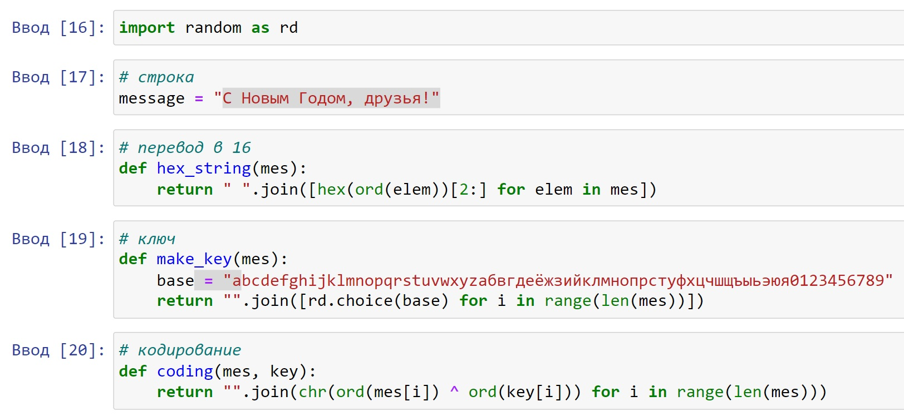
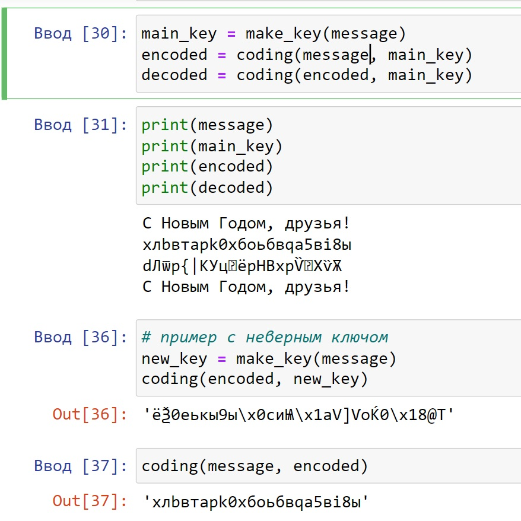

---
## Front matter
lang: ru-RU
title: Презентация к лабораторной работе 7
subtitle: Элементы криптографии. Однократное гаммирование
author:
  - Саттарова В.В.
institute:
  - Российский университет дружбы народов, Москва, Россия
date: 21 октября 2023

## i18n babel
babel-lang: russian
babel-otherlangs: english

## Formatting pdf
toc: false
toc-title: Содержание
slide_level: 2
aspectratio: 169
section-titles: true
theme: metropolis
mainfont: PT Serif
romanfont: PT Serif
sansfont: PT Sans
monofont: PT Mono
header-includes:
 - \metroset{progressbar=frametitle,sectionpage=progressbar,numbering=fraction}
 - '\makeatletter'
 - '\beamer@ignorenonframefalse'
 - '\makeatother'
---

# Информация

## Докладчик

:::::::::::::: {.columns align=center}
::: {.column width="70%"}

  * Саттарова Вита Викторовна
  * студент НФИбд-02-20, 1032201655
  * Российский университет дружбы народов

:::
::::::::::::::

# Вводная часть

## Актуальность и прагматика

- Практические навыки применения шифрования позволяют обеспечить лучшую безопасность информации в системе

## Цели 

- Изучить основы криптографии.
- Освоить на практике применение режима однократного гаммирования.

## Задачи

- Выполнить все пункты, указанные в методических рекомендациях к лабораторной работе.
- Выполняя задания, познакомиться с основами криптографии.
- Выполняя задания, изучить однократное гаммирование.
- Написать отчёт, проанализировав результаты, полученные в ходе выполнения лабораторной работы.

## Контекст и его изменение

## Порт и контекст

# Результаты
- Изучены основы криптографии.
- Освоено на практике применение режима однократного гаммирования. 
- Написан отчёт к лабораторной работе.