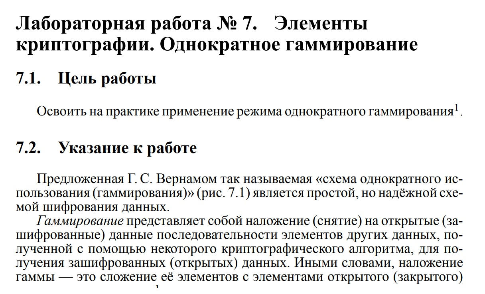

---
## Front matter
lang: ru-RU
title: "Отчёт по лабораторной работе №7 по предмету Информационная безопасность"
subtitle: "Элементы криптографии. Однократное гаммирование"
author: "Саттарова Вита Викторовна"
teacher: "Кулябов Дмитрий Сергеевич"

## Generic otions
lang: ru-RU
toc-title: "Содержание"

## Bibliography
bibliography: bib/cite.bib
csl: pandoc/csl/gost-r-7-0-5-2008-numeric.csl

## Pdf output format
toc: true # Table of contents
toc-depth: 2
lof: true # List of figures
lot: true # List of tables
fontsize: 12pt
linestretch: 1.5
papersize: a4
documentclass: scrreprt
## I18n polyglossia
polyglossia-lang:
  name: russian
  options:
	- spelling=modern
	- babelshorthands=true
polyglossia-otherlangs:
  name: english
## I18n babel
babel-lang: russian
babel-otherlangs: english
## Fonts
mainfont: PT Serif
romanfont: PT Serif
sansfont: PT Sans
monofont: PT Mono
mainfontoptions: Ligatures=TeX
romanfontoptions: Ligatures=TeX
sansfontoptions: Ligatures=TeX,Scale=MatchLowercase
monofontoptions: Scale=MatchLowercase,Scale=0.9
## Biblatex
biblatex: true
biblio-style: "gost-numeric"
biblatexoptions:
  - parentracker=true
  - backend=biber
  - hyperref=auto
  - language=auto
  - autolang=other*
  - citestyle=gost-numeric
## Pandoc-crossref LaTeX customization
figureTitle: "Рис."
tableTitle: "Таблица"
listingTitle: "Листинг"
lofTitle: "Список иллюстраций"
lotTitle: "Список таблиц"
lolTitle: "Листинги"
## Misc options
indent: true
header-includes:
  - \usepackage{indentfirst}
  - \usepackage{float} # keep figures where there are in the text
  - \floatplacement{figure}{H} # keep figures where there are in the text
---

# Цели и задачи работы

**Цели:**

- Изучить основы криптографии.
- Освоить на практике применение режима однократного гаммирования.

**Задачи:**

- Выполнить все пункты, указанные в методических рекомендациях к лабораторной работе.
- Выполняя задания, познакомиться с основами криптографии.
- Выполняя задания, изучить однократное гаммирование.
- Написать отчёт, проанализировав результаты, полученные в ходе выполнения лабораторной работы.

# Объект и предмет исследования

**Объект исследования:** основы шифрования.

**Предмет исследования:** однократное гаммирование.

# Условные обозначения и термины

**Условные обозначения**

Отсутствуют

**Термины**

- шифрование
- однократное гаммирование

# Задание

Нужно подобрать ключ, чтобы получить сообщение «С Новым Годом, друзья!». Требуется разработать приложение, позволяющее шифровать и дешифровать данные в режиме однократного гаммирования. Приложение должно:

1. Определить вид шифротекста при известном ключе и известном открытом тексте.

2. Определить ключ, с помощью которого шифротекст может быть преобразован в некоторый фрагмент текста, представляющий собой один из возможных вариантов прочтения открытого текста.

Более подробно о работе см. в [@course:infosec_lab7](bib/cite.bib).

# Теоретическое введение

## Однократное гаммирование

Предложенная Г. С. Вернамом так называемая «схема однократного использования (гаммирования)» является простой, но надёжной схемой шифрования данных.

Гаммирование представляет собой наложение (снятие) на открытые (зашифрованные) данные последовательности элементов других данных, полученной с помощью некоторого криптографического алгоритма, для получения зашифрованных (открытых) данных. Иными словами, наложение гаммы — это сложение её элементов с элементами открытого (закрытого) текста по некоторому фиксированному модулю, значение которого представляет собой известную часть алгоритма шифрования.

В соответствии с теорией криптоанализа, если в методе шифрования используется однократная вероятностная гамма (однократное гаммирование)
той же длины, что и подлежащий сокрытию текст, то текст нельзя раскрыть. Даже при раскрытии части последовательности гаммы нельзя получить информацию о всём скрываемом тексте.

Наложение гаммы по сути представляет собой выполнение операции сложения по модулю 2 (XOR) между элементами гаммы и элементами подлежащего сокрытию текста. Такой метод шифрования является симметричным, так как двойное прибавление одной и той же величины по модулю 2 восстанавливает исходное значение, а шифрование и расшифрование выполняется одной и той же программой.

Если известны ключ и открытый текст, то задача нахождения шифротекста заключается в применении к каждому символу открытого текста и ключа операции XOR. Размерности открытого текста и ключа должны совпадать, и полученный шифротекст будет такой же длины.

Если известны шифротекст и открытый текст, то задача нахождения ключа решается также, а именно, обе части равенства необходимо применить посимвольно операцию XOR к шифротексту и открытому тексту.

Необходимые и достаточные условия абсолютной стойкости шифра:

- полная случайность ключа;
- равенство длин ключа и открытого текста;
- однократное использование ключа.

Более подробно о работе см. в [@course:infosec_lab7](bib/cite.bib).

# Техническое оснащение и выбранные методы проведения работы

**Техническое оснащение**

- Ноутбук
- Python 3
- Jupyter Notebook
- Интернет

**Методы проведения работы**

- Изучение методической информации
- Выполнение заданий в соответствии с указаниями
- Анализ результатов
- Обобщение проведённой деятельности

# Выполнение лабораторной работы и полученные результаты

1. Скачала и ознакомилась с методическими указаниями к лабораторной работе (рис. @fig:001).

{ #fig:001 width=100% }

2. Создала сообщение и написала основные функции для приложения с однократным гаммированием (рис. @fig:002). 

{ #fig:002 width=100% }

3. Использовала созданные функции, создав ключ для кодирования сообщения, закодировав сообщение и получив шифротекст, а затем раскодировав шифротекст в исходное сообщение тем же ключом. После этого показала, что использование другого ключа даёт иное прочтение текста (не даёт исходное сообщение), а также то, что применение функции кодирования к исходному тексту и шифротексту возвращает значение ключа (рис. @fig:003).

{ #fig:003 width=100% }

# Анализ результатов

Таким образом, были выаолнены задания по изучению однократного гаммирования: было зашифровано сообщение, расшифровано сгенерированным случайно ключом, а также получен ключ для исходного текста по закодированному.

# Заключение и выводы

Таким образом, в ходе выполнения лабораторной работы было сделано следующее: 

- Изучены основы криптографии.
- Освоено на практике применение режима однократного гаммирования. 
- Написан отчёт к лабораторной работе.

# Список литературы

[@course:infosec_lab7](bib/cite.bib)